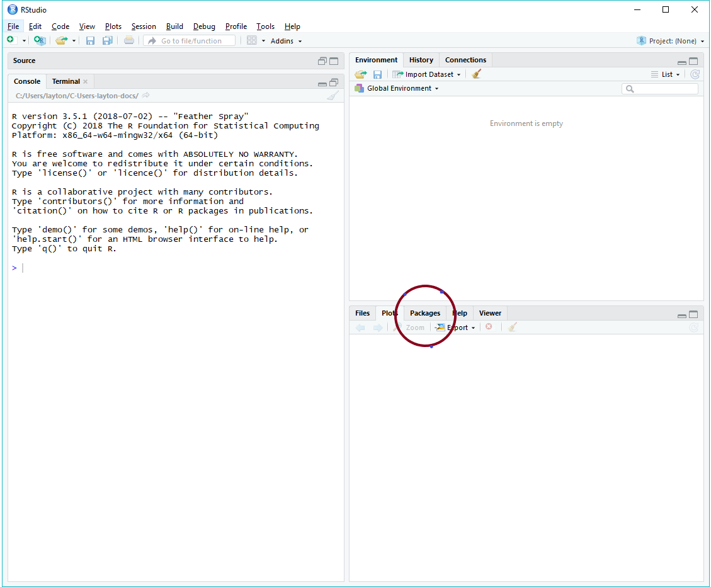
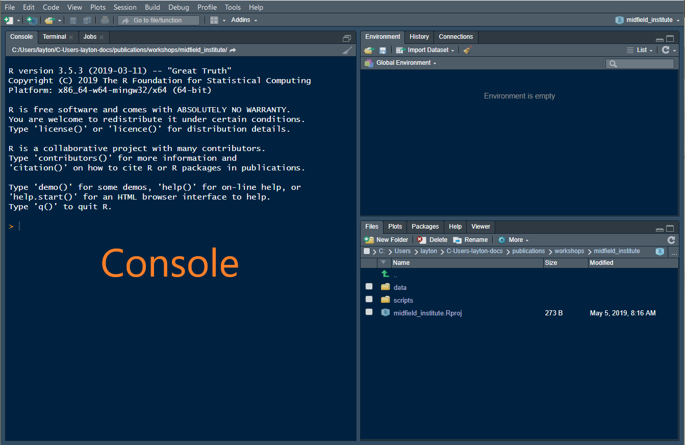

# Getting started {#getting-started}

```{r include=FALSE}
library(knitr)
opts_chunk$set(echo=FALSE)
```

Unless noted otherwise, we assume throughout that the workshop attendee is an R novice. Thus the first steps are to install R and RStudio. 

## Install R and RStudio

Windows users may have to login as an Administrator (localmgr) before installing the software. 

- Install R for your OS: <https://cloud.r-project.org> 
- Install RStudio, a user interface for R:  <https://www.rstudio.com/products/rstudio/#Desktop> 

If you already have R and RStudio installed, please update to the most recent releases and update your R packages as well. 

If you need additional assistance for Mac OS or Linux, these links might be useful 

- [Install R and RStudio on Mac OS](https://medium.com/@GalarnykMichael/install-r-and-rstudio-on-mac-e911606ce4f4) by Michael Galarnyk (or you can Google more recent instructions)    
- [How to Install R Ubuntu 16.04 Xenial](https://www.datascienceriot.com//r/install-ubuntu16/) by Kris Eberwein (or you can Google more recent instructions)  


## Installing an R package

If you know how to install R packages, you can go directly to section \@ref(install-midfield-packages).  

For the R novice, an R package is like an "app" for R---a collection of functions, data, and documentation for doing work in R. To install a package using RStudio,  

- Launch RStudio 

The RStudio interface has several panes. 


```{r}

```

Find the window pane with the *Packages* tab.

- Select the *Packages*  tab 
- Click *Install* 

In the dialog box, 

- Type the name of the package, for example, *drat*  (a package we use to access the midfield data) 
- Select the *Install dependencies* check-box 
- Click *Install*   

This approach is suitable for any package that resides in the Comprehensive R Archive Network ([CRAN](https://cran.r-project.org/)) package repository. 

Some packages, like **midfielddata** are too large to be stored in CRAN, so we use a special "drat-repository" to make the package source files available.

To install the packages, place your cursor in the RStudio *Console* pane. 

```{r}

```

In the console, at the cursor (indicated by  `>`), type each of the following lines of code and press *Enter* from your keyboard, one line at a time. Alternatively, you can copy a line of code from this page, paste it in the console, and press *Enter*. 

 
```
drat::addRepo("midfieldr") 
install.packages("midfielddata") 
install.packages("devtools") 
devtools::install_github("MIDFIELDR/midfieldr") 
```

If you successfully negotiated this section, you can skip the next section because you have installed the packages we need to get started. 


  

## Install the MIDFIELD packages {#install-midfield-packages}

If you know how to install R package, follow the instructions at 
<https://midfieldr.github.io/midfieldr>  to install  

- drat 
- devtools 
- midfielddata
- midfieldr 

At the moment, **midfieldr** is only available from GitHub. Once the package has been submitted to CRAN, you can download it and update it from CRAN. 
