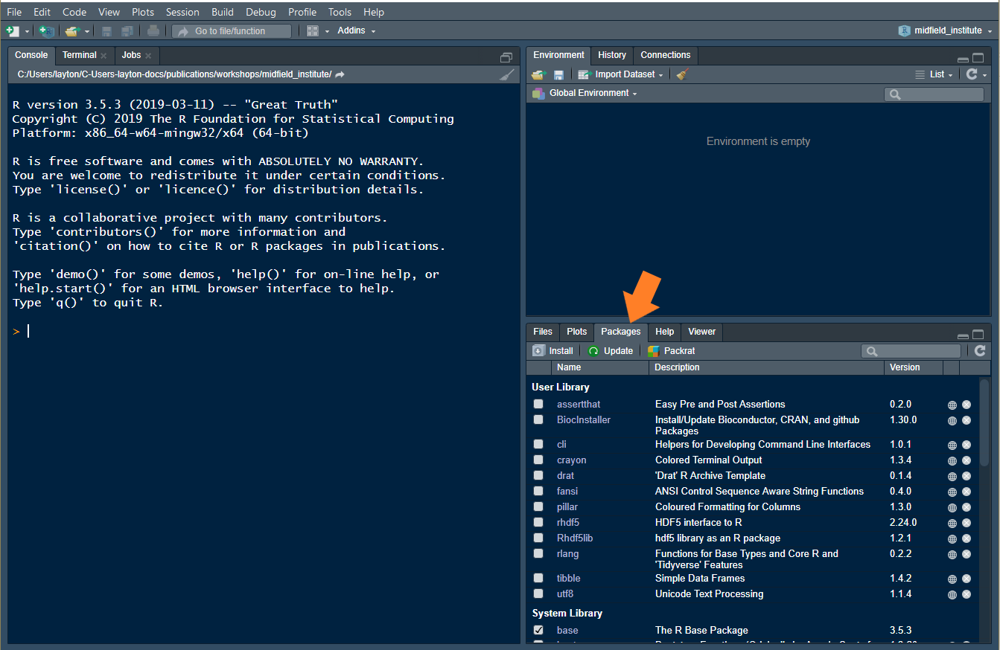

# Getting started {- #getting-started}

```{r include=FALSE}
library(knitr)
opts_chunk$set(echo=FALSE)
opts_chunk$set(fig.width = 6, out.width = "70%", fig.align = "center", fig.asp = 0.618)
```

```{r}
htmltools::img(src = 
knitr::include_graphics("images/midfield-grad-logo.png"), 
               alt = 'logo', 
               style = 'position:absolute; top:50px; right:50px; padding:0px;',
               width = 90)
```

If you are joining us for the first time, it is vital that you attempt to set up your computer with the necessary software in advance or it will be difficult to keep up. 

Unless noted otherwise, we assume the reader is an R novice. Thus the first steps are to install R and RStudio. 


## Install R and RStudio {-}

Windows users may have to login as an Administrator (localmgr) before installing the software. 

- Install R for your OS: <https://cloud.r-project.org> 
- Install RStudio, a user interface for R:  <https://www.rstudio.com/products/rstudio/#Desktop> 

If you already have R and RStudio installed, please update to the most recent releases and update your R packages as well. 

If you need additional assistance for Mac OS or Linux, these links might be useful 

- [Install R and RStudio on Mac OS](https://medium.com/@GalarnykMichael/install-r-and-rstudio-on-mac-e911606ce4f4) by Michael Galarnyk (or you can Google more recent instructions)    
- [How to Install R Ubuntu 16.04 Xenial](https://www.datascienceriot.com//r/install-ubuntu16/) by Kris Eberwein (or you can Google more recent instructions)  


## Installing an R package {-}

The fundamental unit of shareable code in R is the *package.* 
For the R novice, an R package is like an "app" for R---a collection of functions, data, and documentation for doing work in R that is easily shared with others  [@wickham2014advanced]. 

Most packages are obtained from the [CRAN](https://cran.r-project.org/) website [@cranweb]. To install a package using RStudio:

- Launch RStudio 

The RStudio interface has several panes. We want the Files/Plots/Packages pane. 

- Select the *Packages*  tab (circled in the image below). 
- Click *Install* on the ribbon 
- In the dialog box, type **drat** (a package we'll use in a moment) 
- Check the *Install dependencies* box 
- Click the  *Install* button 
- Repeat to install the package **devtools** 
- Repeat to install the package **tidyverse**

```{r}
htmltools::img(src = 
, 
               alt = 'rstudio files-plots-packages pane', 
               width = 700)
```


## Installing midfielddata and midfieldr {-}

In this workshop, we work with the **midfieldr** package and  **midfielddata** data-package. The **midfielddata** package is too large to be stored in CRAN, so we use a special "drat-repository" to make the package source files available.

To install the packages, place your cursor in the RStudio *Console* pane. 

```{r}
htmltools::img(src = 
knitr::include_graphics("images/open-rstudio-console.png"), 
               alt = 'rstudio console pane', 
               width = 700)
```

In the console, at the cursor (indicated by  `>`), type each of the following lines of code and press *Enter* from your keyboard, one line at a time. Alternatively, you can copy a line of code from this page, paste it in the console, and press *Enter*. We only run these lines of code once, so you do not have to type the lines into a script. 

The **drat** `addRepo()` function adds the **midfieldr** GitHub repository to our current R session. 
 
```
addRepo("midfieldr") 
```

**midfielddata**  must be installed before **midfieldr**. 

```
install.packages("midfielddata") 
```

The **devtools**  `install_github()` function installs  **midfieldr** from it's GitHub repository.  

```
install_github("MIDFIELDR/midfieldr") 
```


## Create an R project {-}

In RStudio,

  - *File \> New Project... \> New Directory \> New Project* 
  - Type the workshop name as the directory name, for example, `midfield_institute`,  `fie_workshop`, etc. 
  - Use the browse button to select a location on your computer to create the project  folder 
  - Click the *Create Project* button 

The new project directory will be all of these things: a directory or "folder" on your computer and an RStudio Project.  


## Create directories {-}


File organization is a matter of personal preference, but we do suggest you plan the organization when you start the project. 

We recommend that you always work within an RStudio Project and that you plan your file organiozation from the start. The minimum file structure is shown below, where  `your_project` is the name you gave the project directory such as `midfield_institute` or `fie_workshop`.

<pre><code class=""><span class="line">your_project/
</span><span class="line">    ├── data/
</span><span class="line">    ├── figures/
</span><span class="line">    ├── R/
</span><span class="line">    ├── reports/
</span><span class="line">    └── your_project.Rproj</span></code></pre>

We use the folders as follows: 

- `data` for data files 
- `R` for R scripts that operate on data to produce output such as tidy data or graphs 
- `figures` for finished data displays  
- `reports` for output documents 


And that concludes the setup. 
