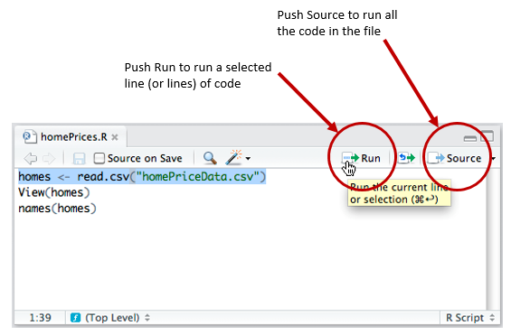

# 2018 FIE Workshop {-}

```{r include=FALSE}
library(knitr)
opts_chunk$set(echo = FALSE, warning = FALSE, message = FALSE, collapse = TRUE)
opts_chunk$set(fig.width = 6, out.width = "70%", fig.align = "center", fig.asp = 0.618)
```

Workshop conducted at the 2018 Frontiers in Education Conference (2018-10-03) in San Jose, CA. 

The goal of the workshop is to share our data, methods, and metrics for intersectional research in student persistence. The workshop is designed for R beginners.

## Pre-workshop setup {-}

- [Getting started](https://midfieldr.github.io/workshops/getting-started.html) for pre-workshop software installation instructions.
- [Preface](https://midfieldr.github.io/workshops/index.html) for an introduction to MIDFIELD and the workshop facilitators. 
 


## Description {-}

The goal of the workshop is to make MIDFIELD more accessible to the FIE community via **midfieldr**. On completing the workshop, participants should be able to 

- Describe key variables in the MIDFIELD data 
- Select academic programs and populations to study
- Use R to compute and graph persistence metrics (e.g., graduation rate) 
- Explain key features of effective data displays 
- Continue using **midfieldr** to study additional persistence metrics

Participants should be sufficiently familiar with their operating systems to install software and navigate directories, but prior experience with R is not required. 


## Agenda  {-}

Workshop activities include think-pair share, active learning, demonstration, discussion, and self-paced software tutorials. Our 3-hour agenda includes: 

```{r}
suppressPackageStartupMessages(library(tidyverse))
df <- tribble(
  ~Min, ~Topic, 
  10, "Introductions", 
  30, "Elements of effective graphs", 
  20, "Getting started with R (tutorial)", 
  10, "Accessing the MIDFIELD data", 
  20, "--- break ---", 
  50, "Using midfieldr (tutorial)", 
  20, "Extending your repertoire",
  20, "Next steps"
  )
kable(df)
```


## Tutorial: Getting started with R  {-}

**1. Create an R project**

Open RStudio. 

- File > New Project > New Directory > New Project 
- Fill in the Directory Name text box with 2018-FIE-midfieldr-workshop
- Select a location on your computer to save the project  
- Check the *Open in a new session* box 
- Click Create Project 

The new project directory will be all of these things:

- a directory or "folder" on your computer 
- an RStudio Project 

On your computer, if you navigate to the new project folder, you should have at least the following folders and files,

    2018-FIE-midfieldr-workshop/
        `-- 2018-FIE-midfieldr-workshop.Rproj

Always begin an R work session by opening the project's Rproj file. Let's practice:

- First, close all RStudio windows 
- Navigate to the workshop folder you jst created 
- Open `2018-FIE-midfieldr-workshop.Rproj`

We work within an R project because it automatically sets project directory as the R *working directory*. 

Set project options 

- Tools > Global Options.


Figure from [R for Data Science](http://r4ds.had.co.nz/workflow-projects.html) Optional reading: To read all about R Projects, see the [RStudio support page](https://support.rstudio.com/hc/en-us/articles/200526207-Using-Projects).


**2. Create an R script**

If you closed the project, then open `2018-FIE-midfieldr-workshop.Rproj` 

- File > New File > R Script 
- An Untitled script will open 
- File > Save As 
- Type in a file name, for example, `get-started.R`
- Save 

In this workshop, all files we create will be saved in the main project folder, with no subdirectories. If you prefer to use subdirectories (folders) inside the project, that's OK. 

In the R file, type 

    library(tidyverse)


To run the script, 

- Save 
- Click the *Run* button to run a selected line or lines of code
- Click *Source* to run the entire script 




If you get an error statement that the package does not exist, you probably have to install the package. In the RStudio, console, just type `install.packages("tidyverse")` 

When the script runs correctly, you should see set of messages like this, 


```
-- Attaching packages --------------------------------------- tidyverse 1.2.1 --
v ggplot2 3.0.0.9000     v purrr   0.2.5     
v tibble  1.4.2          v dplyr   0.7.6     
v tidyr   0.8.1          v stringr 1.3.1     
v readr   1.1.1          v forcats 0.3.0     
-- Conflicts ------------------------------------------ tidyverse_conflicts() --
x dplyr::filter() masks stats::filter()
x dplyr::lag()    masks stats::lag()

```


**3. Look at a tibble**

The tidyverse comes with several data sets. We will use the one called diamonds. 

To get a glimpse of the data, just type its name in the script and run it. 

```{r echo = TRUE}
mpg
```

In this tutorial, R output is indicated by a double hashtag (`##`). The result tells us that the data has 

- `r ncol(mpg)` variables (columns)  
- `r nrow(mpg)` observations (rows) 
- `r names(mpg)[1]` is a variable of type  "`r typeof(mpg[[1]])`" 
- `r names(mpg)[3]` is a variable of type  "`r typeof(mpg[[3]])`" 
- `r names(mpg)[4]` is a variable of type  "`r typeof(mpg[[4]])`" 

In a tidy data frame, every column is a variable and every row is an observation. The `mpg` data is in tidy form. 

A data frame is 2-dimensional data structure with columns of equal lengths. Columns can be of different types (numeric, character, logical, etc.) but all values in a column are the same type. Data frames are the most common way of storing data in R. Optional reading: [Data frames](http://adv-r.had.co.nz/Data-structures.html#data-frames). 

For the sake of our R beginners, we will not belabor the differences between a data frame and a tibble. Tibbles are data frames, but they tweak some older behaviors to make life a little easier. Optional reading: [Tibbles](http://r4ds.had.co.nz/tibbles.html).


**4. Assignment operator**

In R we assign values to objects with the assignment operator, `<-`. For example, suppose we want to assign the value $\pi/4$ to the object $x$. 

```{r echo = TRUE}
# an angle in radians
x <- pi
```

Type the object name `x` to see it's value. 

```{r}
x
```


**5. Functions** 

Functions are fundamental building blocks in R. Functions carry out specified tasks, typically operating on one or more arguments. For example, the cosine function, `cos()`, has one argument, 

```{r echo = TRUE}
cos(x)
```

The help page for a function is found by typing (in the RStudio console pane) a question  mark followed by the function name. For example, `?cos()`. 

A function from the tidyverse that we will use regularly is `glimpse()`. It gives us a useful glimpse of a data frame, showing all the variables (column names) but written down the page, and data runs across the page. making it possible to see every column in a data frame. 

For example, 

```{r echo = TRUE}
glimpse(diamonds)
```

The general form of a function is 

```
function_name(arg1 = value, arg2 = value, ... )
```


**6. Graphs** 


We use the `ggplot()` function from the tidyverse for creating graphs. 


For example, add the following lines to your script and run the code. 

```{r echo = TRUE}
ggplot(data = mpg, mapping = aes(x = displ, y = hwy)) +
  geom_point()
```

These lines are instructions to the `ggplot()` function to 

- use the `mpg` data frame 
- map the the `displ` and `hwy` variables from the data frame as the x and y variables of the scatter plot 
- `+` adds a new layer to the graph 
- `geom_point()` assigns points as the data markers 


**7. Saving results to a file** 

We can save any result to file, for example, to save the graph we just made as a PNG image, we write 


    ggsave("mileage.png")


To save a data frame as a CSV file, 


    write_csv(mpg, "mpg_data.csv")


Add these lines to your scrupt and run it. If you examine your project folder you will find the PNG and CSV files your just made.  Your directory should look like this now, 


    2018-FIE-midfieldr-workshop/
        |-- mpg_data.csv
        |-- mileage.png
        `-- 2018-FIE-midfieldr-workshop.Rproj


**8. More graph stuff** 

We can use a 3rd variable in the data frame, the variable `class`, as a conditioning variable to graph a separate x-y graph for each class of vehivle, using the `facet_wrap()` function as a new layer to the graph. 


```{r echo = TRUE, fig.asp = 1, out.width = "100%"}
ggplot(data = mpg, mapping = aes(x = displ, y = hwy)) + 
  geom_point() + 
  facet_wrap(vars(class))
```


Or, instaed of class, we could condition using the number of cylinders in the engine. 


```{r echo = TRUE, fig.asp = 1, out.width = "100%"}
ggplot(data = mpg, mapping = aes(x = displ, y = hwy)) + 
  geom_point() + 
  facet_wrap(vars(cyl))
```

If we aren't intersested in 5-cylinder cars (?), we omit them from the data frame with the filter() function. 


```{r  echo=TRUE}
mpg_rev <- mpg %>% 
  filter(cyl != 5)
```

- The characters `!=` is "not equal to"
- the pipe operator `%>%` can be read "then" 


```{r echo=TRUE, fig.asp = 5/12, out.width = "100%"}
ggplot(data = mpg_rev, mapping = aes(x = displ, y = hwy)) + 
  geom_point() + 
  facet_wrap(vars(cyl), nrow = 1)
```


