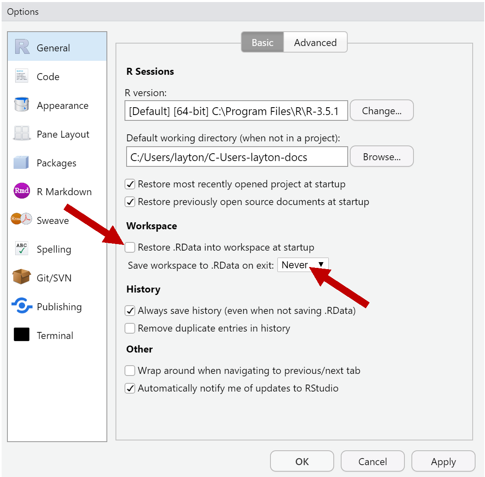
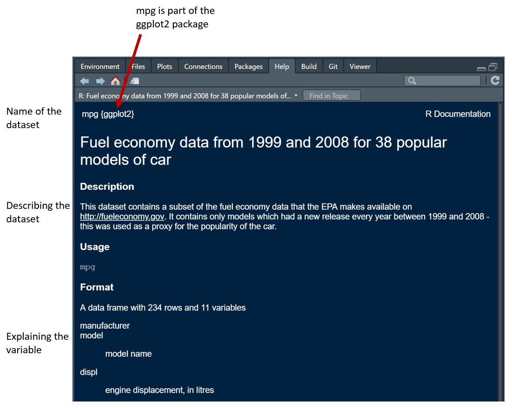

# 2018 FIE Workshop {-}

```{r include=FALSE}
library(knitr)
opts_chunk$set(echo = FALSE, warning = FALSE, message = FALSE, collapse = FALSE)
opts_chunk$set(fig.width = 6, out.width = "70%", fig.align = "center", fig.asp = 0.618)
```


```{r}
htmltools::img(src = 
knitr::include_graphics("images/midfield-grad-logo.png"), 
               alt = 'midfield logo', 
               style = 'position:absolute; top:50px; right:50px; padding:0px;',
               width = 90)
```

Workshop conducted at the 2018 Frontiers in Education Conference (2018-10-03) in San Jose, CA. 

The goal of the workshop is to share our data, methods, and metrics for intersectional research in student persistence. The workshop is designed for R beginners.

## Pre-workshop setup {-}

- [Getting started](https://midfieldr.github.io/workshops/getting-started.html) for pre-workshop software installation instructions.
- [Preface](https://midfieldr.github.io/workshops/index.html) for an introduction to MIDFIELD and the workshop facilitators. 
 


## Description {-}

The goal of the workshop is to make MIDFIELD more accessible to the FIE community via **midfieldr**. On completing the workshop, participants should be able to 

- Describe key variables in the MIDFIELD data 
- Select academic programs and populations to study
- Use R to compute and graph persistence metrics (e.g., graduation rate) 
- Explain key features of effective data displays 
- Continue using **midfieldr** to study additional persistence metrics

Participants should be sufficiently familiar with their operating systems to install software and navigate directories, but prior experience with R is not required. Workshop slides can be viewed on [Speaker Deck](https://speakerdeck.com/graphdr/making-midfield-more-accessible-a-workshop-for-r-beginners-8ce7b993-6625-470f-9ca3-35d12b61f05c). 


## Agenda  {-}

Workshop activities include active learning, discussion, and self-paced software tutorials. Our 3-hour agenda includes: 

```{r}
suppressPackageStartupMessages(library(tidyverse))
df <- tribble(
  ~Min, ~Topic, 
  10, "Introductions", 
  20, "Elements of effective graphs", 
  30, "Starting with R (tutorial)", 
  20, "Accessing the MIDFIELD data", 
  20, "--- break ---", 
  40, "Starting with midfieldr (tutorial)", 
  10, "Extending your repertoire",
  10, "Next steps", 
  20, "Conversations"
  )
kable(df)
```


## Tutorial: Start with R  {-}

This is a self-paced tutorial. 

- Don't worry about the pace of your  work. 
- Everyone works and learns new material at a different pace. 
- Please ask questions of your neighbors as well as the facilitators 
- If you finish early, ask if anyone near you needs assistance 
- Save your work regularly 

**1. Create an R project**

Open RStudio. 

- File > New Project > New Directory > New Project 
- Fill in the Directory Name text box with 2018-FIE-midfieldr-workshop
- Select a location on your computer to save the project  
- Check the *Open in a new session* box 
- Click Create Project 

The new project directory will be all of these things:

- a directory or "folder" on your computer 
- an RStudio Project 

On your computer, if you navigate to the new project folder, you should have at least the following folders and files,

    2018-FIE-midfieldr-workshop/
        |-- 2018-FIE-midfieldr-workshop.Rproj

Always begin an R work session by opening the project's Rproj file. Let's practice:

- First, close all RStudio windows 
- Navigate to the workshop folder you jst created 
- Open `2018-FIE-midfieldr-workshop.Rproj`

We work within an R project because it automatically sets project directory as the R *working directory*. 

Set project options from the Tools pulldown menu

- Tools > Global Options 
- *Restore RData into workspace at startup*:  Uncheck this box 
- *Save workspace to RData on exit*:  Set to Never

```{r}
htmltools::img(src = 
, 
               alt = 'rstudio tools global options window', 
               width = 500)
```


Optional reading: To read all about R Projects, see the [RStudio support page](https://support.rstudio.com/hc/en-us/articles/200526207-Using-Projects).


**2. Create an R script**

If you closed the project, then open `2018-FIE-midfieldr-workshop.Rproj` 

- File > New File > R Script 
- An Untitled script will open 
- File > Save As 
- Type in a file name  `start-with-R.R`
- Save 

Your project main directory should now have these files, 

    2018-FIE-midfieldr-workshop/
        |-- start-with-R.R
        |-- 2018-FIE-midfieldr-workshop.Rproj


In this workshop, all files we create will be saved in the main project folder, with no subdirectories. If you prefer to use subdirectories (folders) inside the project, that's OK, 

In the R file (not the Console), type 

    library(tidyverse)

To run the script, 

- Save 
- Click the *Run* button to run a selected line or lines of code
- Click *Source* to run the entire script 


```{r}
htmltools::img(src = 
, 
               alt = 'showing the run and source buttons', 
               width = 600)
```

Notes 

- If you get an error statement that the package does not exist, you probably have to install the package. 
- When the script runs correctly, you should see set of messages like this, where in this work, a double hashtag (`##`) indicates R output. 


```
## -- Attaching packages ------------------------------ tidyverse 1.2.1 
## v ggplot2 3.0.0.9000     v purrr   0.2.5     
## v tibble  1.4.2          v dplyr   0.7.6     
## v tidyr   0.8.1          v stringr 1.3.1     
## v readr   1.1.1          v forcats 0.3.0     
## -- Conflicts --------------------------------------- tidyverse_conflicts() 
## x dplyr::filter() masks stats::filter()
## x dplyr::lag()    masks stats::lag()

```


Getting help: To see the help page for an R package or function, in your Console type a question mark followed by the object name, e.g., 

    ? tidyverse
    ? library

```{r}
htmltools::img(src = 
 
  , alt = 'help page for the library function' 
  , width = 600
)
```


<br>

**3. Look at a tibble**

The tidyverse comes with several data sets. We will use the one called mpg. 

The help page for the data set tells us its source package and explains the variables. In the Console, type 

    ? mpg


```{r}
htmltools::img(src = 
 
  , alt = 'help page for the mpg dataset' 
  , width = 600
)
```


To get a glimpse of the data, just type its name in the script and run it. 

- In an R script, anything after a single hashtag is treated as a comment. 
- Type the comment in your script. 
- Type `mpg` in your script and run it. 

```{r echo = TRUE}
# mpg is a data frame included in the tidyverse package
mpg
```

The result tells us that the data has 

- `r nrow(mpg)` observations (rows) and `r ncol(mpg)` variables (columns)  
- variable types   "`r typeof(mpg[[1]])`", "`r typeof(mpg[[3]])`", and "`r typeof(mpg[[4]])`" 


*Data frames* are the most common way of storing data in R: a 2-dimensional data structure with columns of equal lengths. Columns can be of different types (numeric, character, logical, etc.) but all values in a column are the same type. Optional reading: [Data frames](http://adv-r.had.co.nz/Data-structures.html#data-frames). 

In a *tidy* data frame, every column is a variable and every row is an observation. The `mpg` data is in tidy form. 

The output above tells us that `mpg` is a *tibble*. Tibbles are data frames, but they tweak some older behaviors to make life a little easier.  Optional reading: [Tibbles](http://r4ds.had.co.nz/tibbles.html).


<br>

**4. Assignment operator**

In R we assign values to objects with the assignment operator, `<-`. For example, suppose we want to assign the value $\pi$ to the object $x$.  Type the following in your script and run it. 

```{r echo = TRUE}
# an angle in radians
x <- pi
```

Type the object name `x` to see it's value.  Type the following in your script and run it. 

```{r echo = TRUE}
x
```


<br>

**5. Functions** 

Functions are fundamental building blocks in R. Functions carry out specified tasks, typically operating on one or more arguments. For example, the cosine function, `cos()`, has one argument. 

 Type the following in your script and run it. 

```{r echo = TRUE}
# above, x was assigned the value of pi radians 
cos(x)
```

A function from the tidyverse that we will use regularly is `glimpse()`. It gives us a useful glimpse of a data frame, showing all the variables (column names) but written down the page, and data runs across the page. making it possible to see every column in a data frame. 

Type the following in your script and run it. 

```{r echo = TRUE}
glimpse(mpg)
```

The general form of a function is 

```
function_name(arg1 = value, arg2 = value, ... )
```

<br>

**6. Graphs** 


We use the `ggplot()` function from the tidyverse for creating graphs. 

- Sometimes when clicking Source, a plot is not sent to the output. If that happens, select all the lines of code and press Run. 

Type the following in your script and run it. 

```{r echo = TRUE}
ggplot(data = mpg, mapping = aes(x = displ, y = hwy)) +
  geom_point()
```

`ggplot()` arguments:

- `data` argument assigns the data frame  
- `mapping` argument assigns the aesthetics `aes()` function 
- `x` and `y` arguments assign variables from the data frame for graphing   
- `+` adds a new layer to the graph 
- `geom_point()` assigns points as the data markers 


<br>

**7. Saving results to a file** 

We can save any result to file, for example, to save the graph we just made as a PNG image, type the following in your script and run it.


    ggsave("mileage.png")


with a filename in quotes, here `"mileage.png"`. To save a data frame as a CSV file, we use `write_csv()` (tidyverse).  Type the following in your script and run it. 


    write_csv(mpg, "mpg_data.csv")

where `mpg` is the data frame to be written and `"mpg_data.csv"` is the filename. Add these lines to your script and run it. 

If you examine your project folder you will find the PNG and CSV files your just made.  Your directory should look like this now, 


    2018-FIE-midfieldr-workshop/
        |-- start-with-R.R
        |-- mpg_data.csv
        |-- mileage.png
        |-- 2018-FIE-midfieldr-workshop.Rproj


<br>

**8. Small multiple graphs** 

We can use a 3rd variable from the data frame, the variable `class`, as a conditioning variable to create a set of small multiples (or *facets*). The new graph layer is created using the `facet_wrap()` function. 

Type the following in your script and run it.


```{r echo = TRUE, fig.asp = 1, out.width = "100%"}
ggplot(data = mpg, mapping = aes(x = displ, y = hwy)) + 
  geom_point() + 
  facet_wrap(vars(class))
```


Or, instead of class, we could condition using the number of cylinders in the engine. Type the following in your script and run it.


```{r echo = TRUE, fig.asp = 1, out.width = "100%"}
ggplot(data = mpg, mapping = aes(x = displ, y = hwy)) + 
  geom_point() + 
  facet_wrap(vars(cyl))
```

<br>

**9. filter() and the pipe operator** 

If we aren't interested in 5-cylinder cars, we omit them from the data frame with the `filter()` function (tidyverse). Filter is a row-operation, keeping all rows that meet the conditional statement and removing all other rows. Here we'll use the condition `cyl != 5`, that is, keep all rows for which the value of the  `cyl` variable is not equal to 5 (`!` is the negation operator). 

Type the following in your script and run it.

```{r  echo=TRUE}
mpg_rev <- mpg %>% 
  filter(cyl != 5)
```

I've also introduced the pipe operator `%>%` here. After assigning `mpg` to a new object `mpg_rev`, the pipe allows us to operate on the result `mpg_rev` and filter its rows, leaving the original`mpg` data frame unaltered. 

Thus, the pipe operator can be thought of as a "then" statement. Do this, "then" use the result and perform the next operation. 


The same graph with the revised data frame has only three facets. The  `nrow = 1` argument places the panels in one row.

Type the following in your script and run it.

```{r echo=TRUE, fig.asp = 5/12, out.width = "100%"}
ggplot(data = mpg_rev, mapping = aes(x = displ, y = hwy)) + 
  geom_point() + 
  facet_wrap(vars(cyl), nrow = 1)
```


<br>

**10. Smooth curve** 

Adding the `geom_smooth()` layer adds a loess curve (a local regression) to each panel. 

Type the following in your script and run it.

```{r echo=TRUE, fig.asp = 5/12, out.width = "100%"}
ggplot(data = mpg_rev, mapping = aes(x = displ, y = hwy)) + 
  geom_point() + 
  facet_wrap(vars(cyl), nrow = 1) + 
  geom_smooth()
```


If we want to try a linear regression , add the argument  `method - "lm"`. Type the following in your script and run it.


```{r echo=TRUE, fig.asp = 5/12, out.width = "100%"}
ggplot(data = mpg_rev, mapping = aes(x = displ, y = hwy)) + 
  geom_point() + 
  facet_wrap(vars(cyl), nrow = 1) + 
  geom_smooth(method = "lm")
```

The shaded area around the regression is the confidence interval. We can remove it using the argument `se = FALSE`. Type the following in your script and run it.

```{r echo=TRUE, fig.asp = 5/12, out.width = "100%"}
ggplot(data = mpg_rev, mapping = aes(x = displ, y = hwy)) + 
  geom_point() + 
  facet_wrap(vars(cyl), nrow = 1) + 
  geom_smooth(method = "lm", se = FALSE)
```


<br>

**11. Labels** 

We can change the axis labels and add a title (above the figure)  and a caption (below the figure) using the `labs()` layer. Type `? mpg` in the Console to find out that the engine displacement is in liters. 

Type the following in your script and run it.


```{r echo=TRUE, fig.asp = 6/12, out.width = "100%"}
ggplot(data = mpg_rev, mapping = aes(x = displ, y = hwy)) + 
  geom_point() + 
  facet_wrap(vars(cyl), nrow = 1) + 
  geom_smooth(method = "lm", se = FALSE) +
  labs(x = "Engine displacement (liters)", 
       y = "Highway mileage (mpg)",
       title = "Fuel economy of popular cars, 1199--2008",
       caption = "EPA http://fueleconomy.gov")
```


<br>

**12. Wrap-up**

This concludes our brief introduction to R. You learned to 

- Create an R project 
- Create an R script 
- Save and run an R script  

Regarding R syntax you should be able to 

- Describe a data frame 
- Describe the attributes of a tidy data frame 
- Use the assignment operator 
- Describe basic components of an R function 
- Draw a simple scatterplot 
- Create small multiples 
- Add a smooth loess curve to a graph 
- Add a linear regression to a graph 
- Save a graph as a PNG file 
- Save a data frame as a CSV file 


## Tutorial: Start with midfieldr  {-}

This is a self-paced tutorial illustrating functions in the midfieldr package.

- Don't worry about the pace of your  work. 
- Everyone works and learns new material at a different pace. 
- Please ask questions of your neighbors as well as the facilitators 
- If you finish early, ask if anyone near you needs assistance 
- Save your work regularly 


**Create a new R script**

If you closed the project, then open `2018-FIE-midfieldr-workshop.Rproj` 

- File > New File > R Script 
- An Untitled script will open 
- File > Save As 
- Type in a new file name, for example, `start-with-midfieldr.R`
- Save 


Your directory should look like this now, 


    2018-FIE-midfieldr-workshop/
        |-- start-with-midfieldr.R
        |-- start-with-R.R
        |-- mpg_data.csv
        |-- mileage.png
        |-- 2018-FIE-midfieldr-workshop.Rproj 


When you navigate to the tutorial website, you will   

- Follow the instructions, adding lines of code to your new script 
- Run the script after adding each line of code 
- The URL is https://midfieldr.github.io/midfieldr/index.html 
- Select the *Getting started* tab 
- Scroll down to *Select programs to study* 


```{r}
htmltools::img(src = 

  , alt = 'the midfieldr getting started web page')
```


## Acknowledgements {-}

Our sincere thanks to our "R-bar" volunteers Hossein Ebrahiminejad and Matt Scheidt, without whom the software tutorials could not have as smoothly as they did. 


## References {-}
