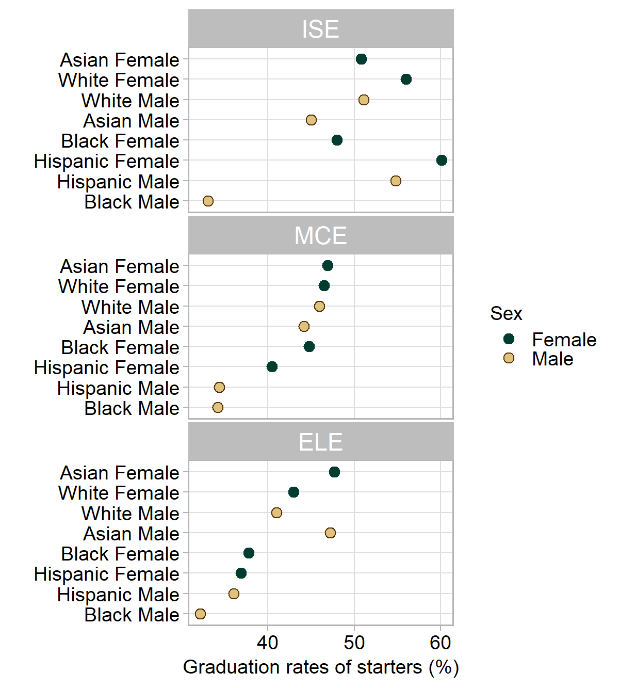

# 2018 FIE Workshop {-}

```{r include=FALSE}
library(knitr)
opts_chunk$set(echo=FALSE)
opts_chunk$set(fig.width = 6, out.width = "70%", fig.align = "center", fig.asp = 0.618)
```

Workshop conducted at the 2018 Frontiers in Education Conference (2018-10-03) in San Jose, CA. 

The goal of the workshop is to share our data, methods, and metrics for intersectional research in student persistence. The workshop is designed for R beginners.

- [Preface](https://midfieldr.github.io/workshops/index.html) for an introduction to MIDFIELD and the workshop facilitators. 
- [Getting started](https://midfieldr.github.io/workshops/getting-started.html) for pre-workshop software installation instructions. 


## Description  {-}

The goal of the workshop is to make MIDFIELD more accessible to the FIE community via **midfieldr**. On completing the workshop, participants should be able to 

- Describe key variables in the MIDFIELD data 
- Select academic programs and populations to study
- Use R to compute and graph persistence metrics (e.g., graduation rate) 
- Explain key features of effective data displays 
- Continue using **midfieldr** to study additional persistence metrics

Participants should be sufficiently familiar with their operating systems to install software and navigate directories, but prior experience with R is not required. 


## Agenda  {-}

Workshop activities include think-pair share, active learning, demonstration, discussion, and self-paced software tutorials. Our 3-hour agenda includes: 

```{r}
suppressPackageStartupMessages(library(tidyverse))
df <- tribble(
  ~ Min, ~Topic, 
   10, "Introductions", 
   30, "Designing effective data displays (interactive)", 
   20," Getting started with R (interactive)", 
   20, "Break", 
   20, "Exploring the structure of the MIDFIELD data sample", 
   45, "Using R for persistence metrics (self-paced tutorial)", 
   15, "Additional persistence metrics using R", 
   20, "Discussing next steps and assessing the workshop"
  )
kable(df)
```


## Sample result {-}

A common example of a persistence metric is graduation rate: the fraction of starters in a major who graduate in the major. The figure shows graduation rates for students in three majors---Industrial Engineering (ISE), Mechanical Engineering (MCE), and Electrical Engineering (ELE)---disaggregated by sex and race/ethnicity. 

```{r out.width = "50%", fig.cap = "Graduation rates of students in three engineering majors."}

```

The rows of this graph are ordered by the mean graduation rate of each student group across all three panels, allowing us to detect visual anomalies. For example, Hispanic Female students in ISE graduate at a much higher rate than expected given their average rate across all three majors.

Data of this type are *multiway data* and the graph is a *multiway dot plot* [@Cleveland1993]. Because persistence data often have a multiway structure, we regularly use this graph type for data exploration and presentation [@LaytonLord2009] and we include it as a default graph type in **midfieldr**. 


