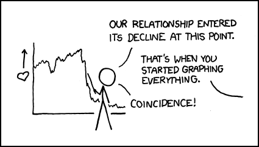

## Graph basics {#graph-basics} 

<!-- Use  knitr:: child = to include as a section in a chapter-->

```{r include = FALSE}
library(knitr)
opts_chunk$set(echo = FALSE)
opts_chunk$set(fig.width = 6, 
        out.width = "70%", 
        fig.align = "center", 
        fig.asp   = 0.618, 
        comment   = "#>", 
        warning   = FALSE, 
        message   = FALSE)

library("tidyverse")
```

```{r echo = FALSE}
opts_chunk$set(echo = TRUE)
htmltools::img(src = , 
        alt = 'logo', 
        style = 'left:0px; padding:0px;', 
        width = 400)
```
<small>
<br>
<i>Decline</i> by Randall Munroe (xkcd.com) is licensed under <a href="https://creativecommons.org/licenses/by-nc/2.5/">CC BY-NC 2.5</a>
<br>
</small>

An introduction to ggplot2  adapted from Chapter 3  from [@Healy:2019]. If you already have R experience, you might still want to browse this section in case you find something new. 

If the prerequisites have been met, the tutorial should take no longer than 50 minutes.  


### Prerequisites {} 

- We assume you have completed all of the [Getting started](#getting-started) instructions. 
- Run `midfield_institute.Rproj` to start every work session 

Packages 

- If any of these packages have not yet been installed, they can be installed using these commands, 

```r
install.packages("tidyverse")
install.packages("gapminder") 
```

Use *File &gt; New File &gt; R Script* to create a new R script

- Name the script `02-graph-basics.R`   
- Save it in the `scripts` directory 

Add a minimal header at the top of the script (if you wish) then use `library()`  to load the packages we will use. Loading all the libraries at the top of a script is conventional practice. 

```{r}
# workshop graph basics 
# name 
# date 

library("tidyverse")
library("gapminder")
```


Guidelines 

- In this script type the lines of code in the tutorial below one line at a time.  
- After every line, *File &gt; Save*, and hit the *Source* button to run the code.  
- Confirm that your result matches the result in the tutorial.  
- **Your turn** exercises give you chance to devise your own examples and check them out. You learn by doing (but you knew that already)!


### Tidy data {}

If the data set is "tidy", then every row is an observation and every column is a variable.  The `gapminder` data frame is tidy. We use `glimpse()` to get a look at the structure. 

```{r}
glimpse(gapminder)
```

And we can just type its name to see the first few rows, 

```{r}
gapminder
```


Read more about [tidy data](https://r4ds.had.co.nz/tidy-data.html#tidy-data-1) in [@Wickham+Grolemund:2017].  

<br>   

> **Your turn.** The ggplot2 package includes a dataset called `mpg`. 
>
- Use `glimpse()` to examine the data set. 
- How many variables? How many observations? 
- How many of the variables are numeric? How many are character type? 
- Is the data set tidy? 
> 
> *Check your work.* There are `r nrow(mpg)` observations and `r ncol(mpg)` variables. 

```{r include = FALSE}
glimpse(mpg)
n_var      <- ncol(mpg)
n_obs      <- nrow(mpg)
n_char_var <- ncol(select_if(mpg, is.character))
n_num_var  <- ncol(select_if(mpg, is.numeric))
```


### Anatomy of a graph  

`ggplot()` is a our basic plotting function. The `data = ...` argument assigns the data frame. 

```{r}
p <- ggplot(data = gapminder)
```

Next we use the mapping argument `mapping = aes(...)` to assign variables  (column names) from the data frame to specific aesthetic properties of the graph such as the x-coordinate, the y-coordinate color, fill, etc. 

Here we will map the GDP per capita variable to `x` and the life expectancy variable to `y`. 

```{r}
p <- ggplot(data = gapminder, mapping = aes(x = gdpPercap, y = lifeExp))
```

If we try to print the graph by typing the name of the graph object (everything in R is an object), we get an empty graph because we haven't told ggplot what sort of a graph we want. 

```{r}
p
```

Because the graph will be a scatterplot, we add the `geom_point()` layer. 

```{r}
p <- p +geom_point()

p # display the graph
```

In ggplot2, "geoms" are geometric objects such as points, lines, bars, boxplots, contours, polygons, etc. You can browse the full list on the ggplot2 [geom reference page](https://ggplot2.tidyverse.org/reference/index.html#section-layer-geoms). 

We could also have simply added the layer to the original object, 

```{r}
p <- ggplot(data = gapminder, mapping = aes(x = gdpPercap, y = lifeExp)) +
        geom_point()

p # display the graph
```

Notice that the default axis labels are the variables names from the data frame. We can edit those with another layer 

```{r}
p <- p + labs(x = "GDP per capita", y = "Life expectancy (years)")

p # display the graph
```

Or, with all layers shown in one code chunk, 

```{r}
p <- ggplot(data = gapminder, mapping = aes(x = gdpPercap, y = lifeExp)) +
        geom_point() +
        labs(x = "GDP per capita", y = "Life expectancy (years)")

p # display the graph
```

Summary. The basics steps for building up the layers of any graph consist of, 

- assign the data frame 
- map variables (columns names) to aesthetic properties  
- choose geoms  
- adjust scales, labels, etc. 

For more information  

- [aes()](https://ggplot2.tidyverse.org/reference/aes.html) help page 
- [geom_point()](https://ggplot2.tidyverse.org/reference/geom_point.html) help page 
- [geom_labs()](https://ggplot2.tidyverse.org/reference/labs.html) help page 

<br>   

> **Your turn.** 
> 
- In the console, type `? mpg` to see the data set help page. Skim the descriptions of the variables.  
- Create a scatterplot of highway miles per gallon as a function of engine displacement in liters. 
> 
> *Check your work:*

```{r echo = FALSE}
ggplot(mpg, aes(displ, hwy)) +
    geom_point()
```


### Layer: smooth fit

Suppose you wanted a smooth fit curve, not necessarily linear. Add a  `geom_smooth()` layer. The name *loess* (pronounced like the proper name Lois) is a nonparametric curve-fitting method based on *local regression*. 

```{r}
p <- p + geom_smooth(method = "loess", se = FALSE)

p # display the graph
```

The `se` argument controls whether or not the confidence interval is displayed. Setting `se = TRUE` yields, 

```{r}
p <- p + geom_smooth(method = "loess", se = TRUE)

p # display the graph
```

For a linear-fit layer, we add a layer with `method` set to `lm` (short for linear model). The linear fit is not particularly good in this case, but now you know how to do one. 

```{r}
p <- p + geom_smooth(method = "lm", se = TRUE)

p # display the graph
```

For more information  

- [geom_smooth()](https://ggplot2.tidyverse.org/reference/geom_smooth.html) help page 

<br>   

> **Your turn.** Continue to practice with `mpg`.
>
- Add a loess curve fit with a confidence interval. 
> 
> *Check your work:*

```{r echo = FALSE}
ggplot(mpg, aes(displ, hwy)) +
    geom_point() +
    geom_smooth(method = "loess", se = TRUE)
```


### Layer: log scale

```{r echo = FALSE}
options(scipen = 999)
```

We have orders of magnitude differences in the GDP per capita variable. To confirm, we can create a `summary()` of the `gdpPercap`  variable. The output shows that the minimum is `r round(min(gapminder[["gdpPercap"]]), 0)`, the median  `r round(median(gapminder[["gdpPercap"]]), 0)`, and the maximum  `r round(max(gapminder[["gdpPercap"]]), 0)`. 

```{r}
# extract one variable from the data frame 
this_variable <- gapminder["gdpPercap"]

# statistical summary of one variable 
summary(this_variable)
```

The bracket notation I just used, `gapminder["gdpPercap"]`, is one way to extract a variable from a data frame. 

In exploring a graph like this, it might be useful to add a layer that changes the horizontal scale to a log-base-10 scale. 

```{r}
p <- ggplot(data = gapminder, mapping = aes(x = gdpPercap, y = lifeExp)) +
        geom_point() +
        scale_x_log10() 

p # display the graph
```

The scales package allows us to change the GDP scale to dollars. Using the syntax `thepackage::thefunction` we can use the `scales::dollar` function without loading the scales package. 

```{r}
p <- ggplot(data = gapminder, mapping = aes(x = gdpPercap, y = lifeExp)) +
        geom_point() +
        scale_x_log10(labels = scales::dollar)

p # display the graph
```

In this case, a linear fit might work, 

```{r}
p <- p + geom_smooth(method = "lm", se = TRUE)

p # display the graph
```

Update the axis labels, 

```{r}
p <- p + labs(x = "GDP per capita (log10 scale)", y = "Life expectancy (years)")

p # display the graph
```

In summary, all the layers could have been be coded at once, for example, 

```{r eval = FALSE}
p <- ggplot(data = gapminder, mapping = aes(x = gdpPercap, y = lifeExp)) +
        geom_point() +
        geom_smooth(method = "lm", se = TRUE) +
        scale_x_log10(labels = scales::dollar) +
        labs(x = "GDP per capita (log10 scale)", y = "Life expectancy (years)")
```

With all the layers in one place, we can see that we've coded all the basic steps, that is, 

- assign the data frame 
- map variables (columns names) to aesthetic properties  
- choose geoms 
- adjust scales, labels, etc. 

For more information  

- [scale_x_log10()](https://ggplot2.tidyverse.org/reference/scale_continuous.html) help page 


<br>   

> **Your turn.** Continue to practice with `mpg`.
>
- Edit the axis labels to include units.  
> 
> *Check your work:*

```{r echo = FALSE}
ggplot(mpg, aes(displ, hwy)) +
    geom_point() +
    geom_smooth(method = "loess", se = TRUE) +
    labs(x = "Engine displacement (liters)", y = "Highway fuel consumption (mpg)")
```


### Mapping aesthetics

So far, we have mapped variables only to the x-coordinate and y-coordinate aesthetics. 

If we map a variable to the color aesthetic, the data symbols are automatically assigned different colors and a legend is created. In this example, we map the `continent`  variable to color.  

```{r}
p <- ggplot(data = gapminder, 
                mapping = aes(x = gdpPercap, y = lifeExp, color = continent)) +
        geom_point() +
        scale_x_log10(labels = scales::dollar) + 
        labs(x = "GDP per capita", y = "Life expectancy (years)")

p # print the graph
```


<br>   

> **Your turn.** Continue to practice with `mpg`.
>
- Map vehicle class to color 
- Change the curve fit to linear 
> 
> *Check your work:*

```{r echo = FALSE}
ggplot(mpg, aes(displ, hwy, color = class)) +
    geom_point() +
    geom_smooth(method = "lm", se = FALSE) +
    labs(x = "Engine displacement (liters)", y = "Highway fuel consumption (mpg)")
```


### Setting properties 

Because the colors overprint, we might try making the data symbols slightly transparent. In this case, we are not mapping a property to a variable; instead, we want all data symbols to be less opaque. 

 The `alpha` argument, with $0 \leq \alpha \leq 1$, sets the transparency level. Because this change applies to all data points equally, we assign it in the geom, not `aes()`. 

```{r}
p <- ggplot(data = gapminder, 
                mapping = aes(x = gdpPercap, y = lifeExp, color = continent)) +
        geom_point(alpha = 0.3) +
        scale_x_log10(labels = scales::dollar) + 
        labs(x = "GDP per capita", y = "Life expectancy (years)")

p # print the graph
```

If we add a linear fit to these data, a fit for each continent is generated. For a thinner line, I've added a `size` argument to the geom.  

```{r}
p <- p + geom_smooth(method = "lm", se = FALSE, size = 0.5)

p # print the graph
```

If we want all the data markers the same color but we want to change the color, we don't map it, we set it in the geom. 

Here, I've omitted the aesthetic mapping to color and used a color assignment in the geom. 

```{r}
p <- ggplot(data = gapminder, mapping = aes(x = gdpPercap, y = lifeExp)) +
        geom_point(alpha = 0.3, color = "purple1") +
        geom_smooth(method = "lm", se = FALSE, size = 0.5, color = "purple4") + 
        scale_x_log10(labels = scales::dollar) + 
        labs(x = "GDP per capita (log10 scale)", y = "Life expectancy (years)")

p # print the graph
```

For more information 

- [R color names](http://www.stat.columbia.edu/~tzheng/files/Rcolor.pdf) 


### Layer: facets  

In the earlier graph where we mapped continent to color, there was a lot of overprinting, making it difficult to compare the continents. 

The `facet_wrap()` layer separates the data into different panels (or facets). Like the `aes()` mapping, `facet_wrap()` is applied to a variable (column name) in the data frame. 

```{r}
p <- p + facet_wrap(facets = vars(continent))

p # print the graph
```

Comparisons are facilitated by having the facets appear in one column, by using the `ncols` argument of `facet_wrap()`. 

```{r fig.asp = 2/1}
p <- p + facet_wrap(facets = vars(continent), ncol = 1)

p # print the graph
```

In a faceted display, all panels have identical scales (the default) to facilitate comparison. 

Again, all the layers could have been be coded at once, for example, 

```{r eval = FALSE}
ggplot(data = gapminder, mapping = aes(x = gdpPercap, y = lifeExp)) +
        geom_point(alpha = 0.3, color = "purple1") +
        geom_smooth(method = "lm", se = FALSE, size = 0.5, color = "purple4") + 
        facet_wrap(facets = vars(continent), ncol = 1) +
        scale_x_log10(labels = scales::dollar) + 
        labs(x = "GDP per capita (log10 scale)", y = "Life expectancy (years)") 
```

For more information  

- [facet_wrap()](https://ggplot2.tidyverse.org/reference/facet_wrap.html) help page 


<br>   

> **Your turn.** Continue to practice with `mpg`. 
>
- Map drive type to color 
- Facet on vehicle class 
- Add some transparency to the data symbols 
- Omit the smooth fit 
> 
> *Check your work:*

```{r echo = FALSE, fig.asp = 1, out.width = "80%"}
ggplot(mpg, aes(displ, hwy, color = drv)) +
    geom_point(alpha = 0.5) +
    facet_wrap(vars(class), as.table = FALSE) +
    labs(x = "Engine displacement (liters)", y = "Highway fuel consumption (mpg)")
```


### Ordering the panels

The default ordering of the panels in this example is alphabetical. In most cases, ordering the panels by the data (often the mean or the median) improves the display. 

Here we have two quantitative variables, but the one that is the more interesting is life expectancy. Our goal then is to order the `continent` variable by the median of the `lifeExp` variable in each panel.  

To do that, we require continent to be a *factor*, a type of variable specialized for creating ordered levels of a category. Using `glimpse()` we see that continent is already a factor (`<fct>`). 

```{r}
glimpse(gapminder)
```

Therefore all we have to do is tell R that we want the levels of continent ordered by the median of life expectancy using the `fct_reorder()` function.  

```{r}
gapminder <- gapminder %>%
        mutate(continent = fct_reorder(continent, lifeExp, median))
```

In doing so, I've overwritten the original gapminder dataset with my revised version. 

We set the `as.table ` argument to false to place the panel with the highest life expectancy in the top position. 

```{r fig.asp = 2/1}
ggplot(data = gapminder, mapping = aes(x = gdpPercap, y = lifeExp)) +
        geom_point(alpha = 0.3, color = "purple1") +
        geom_smooth(method = "lm", se = FALSE, size = 0.5, color = "purple4") + 
        facet_wrap(facets = vars(continent), ncol = 1, as.table = FALSE) + 
        scale_x_log10(labels = scales::dollar) + 
        labs(x = "GDP per capita (log10 scale)", y = "Life expectancy (years)") 
```

For more information  

- [mutate()](https://dplyr.tidyverse.org/reference/mutate.html) help page 
- [fct_reorder()](https://forcats.tidyverse.org/reference/fct_reorder.html) help page 


<br>   

> **Your turn.** Continue to practice with `mpg`. 
>
- Convert `class` to a factor ordered by the mean highway mileage 
- Same graph as before, but order the panels by mean fuel consumption  
> 
> *Check your work:*

```{r echo = FALSE, fig.asp = 1, out.width = "80%"}
mpg <- mpg %>% 
    mutate(class = fct_reorder(class, hwy, mean))

p <- ggplot(mpg, aes(displ, hwy, color = drv)) +
    geom_point(alpha = 0.5) +
    facet_wrap(vars(class), as.table = FALSE) +
    labs(x = "Engine displacement (liters)", y = "Highway fuel consumption (mpg)")
p
```


### Beyond the basics

Demonstrating how the basics can be built upon to create a complex data graphic. 

To wrap up this introduction, I'll show you how we can use functions in various layers to show all the data in every panel; add a common overall loess smooth fit; and highlight the the continent data in each panel, making it easier to compare each continent to the global data. 

Because life expectancy has generally increased over time, I'm going to restrict this final graph to 2007, the most recent year in this dataset. 

Typing this code in your script is optional. Without further explanation, here's the code. 

```{r fig.asp = 2/1, results = 'hide'}
gapminder <- gapminder %>%
        filter(year == 2007)

ggplot(data = gapminder, mapping = aes(x  = gdpPercap / 1000, y = lifeExp)) +
        geom_point(data = select(gapminder, -continent),
                size  = 1.25,
                alpha = 0.5, 
                color = "#80cdc1") +
        geom_smooth(data = select(gapminder, -continent),
                method = "loess",
                se    = FALSE,
                size  = 0.7,
                color = "#80cdc1") +
        geom_point(mapping = aes(color = continent),
                size  = 1.25,
                color = "#01665e") +
        facet_wrap(vars(continent),
                ncol = 1,
                as.table = FALSE) +
        labs(x = "GDP per capita (thousands of dollars)",
                y = "Life expectancy (years)",
                title  = "Life expectancy by country, 2007",
                caption = "Source: Gapminder") +
        theme(legend.position = "none")
```

For more information  

- [select()](https://dplyr.tidyverse.org/reference/select.html) help page 
- [filter()](https://dplyr.tidyverse.org/reference/filter.html) help page 
- [theme()](https://ggplot2.tidyverse.org/reference/index.html#section-themes) help page 
- [ColorBrewer](http://colorbrewer2.org/) for color hex codes 


### Resize and write to file 

For consistent control over the size and aspect ratio of your publication-ready graph, you should always conclude your design by saving the image and sizing it at the same time. 

Here, we save the figure to the `figures` directory we set up earlier. 

```{r}
ggsave(filename = "figures/02-graph-basics-gapminder.png", 
        width  = 6.5,
        height = 10.5,
        units  = "in", 
        dpi    = 300)
```

And the final figure looks like this: 

```{r echo = FALSE}
htmltools::img(src = knitr::include_graphics("figures/02-graph-basics-gapminder.png"), 
        alt   = "figures/02-graph-basics-gapminder", 
        style = "display: block; margin-left: auto; margin-right: auto;",  
        width = "500px")
```

For more information  

- [ggsave()](https://ggplot2.tidyverse.org/reference/ggsave.html) help page 


> **Your turn.** Continue to practice with `mpg`.
>
>
- Write your ggsave() code chunk immediately following the ggplot() code chunk of the graph you want to save. 
- Use ggsave to write your graph to the `figures` directory with the name `02-graph-basics-mpg.png` 
- Try a 6 in by 6 in figure size 
> 
> *Check your work:* Navigate to your `figures` folder. The new png file should be there. Open it to confirm it is the figure you expect. 

```{r echo = FALSE}
ggsave(filename = "figures/02-graph-basics-mpg.png", 
        plot = p, 
        width  = 6,
        height = 6,
        units  = "in", 
        dpi    = 300)
```


<br>
Feel free to take a break before starting the next tutorial. 
