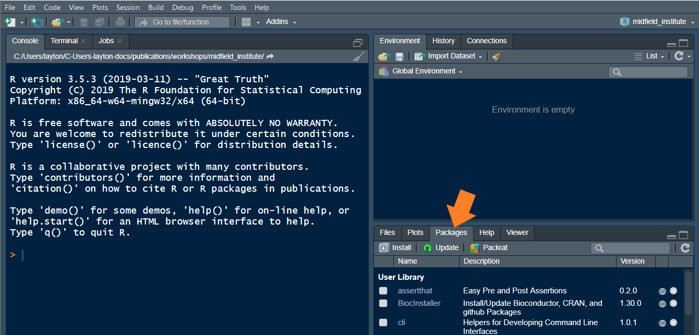

# Getting started {- #getting-started}

<!-- This file is included in the book only if it is listed in the _bookdown.yml file. -->

```{r include=FALSE}
library(knitr)
opts_chunk$set(echo=FALSE)
opts_chunk$set(fig.width = 6, out.width = "70%", fig.align = "center", fig.asp = 0.618, comment = "#>")
```

```{r}
htmltools::img(src = 
knitr::include_graphics("images/midfield-grad-logo.png"), 
               alt = 'logo', 
               style = 'position:absolute; top:50px; right:50px; padding:0px;',
               width = 90)
```

If you are joining us for the first time, it is vital that you attempt to set up your computer with the necessary software in advance or it will be difficult to keep up. 

Unless noted otherwise, we assume the reader is an R novice. Thus the first steps are to install R and RStudio. 


## Install R and RStudio {-}

Windows users may have to login as an Administrator (localmgr) before installing the software. 

- Install R for your OS: <https://cloud.r-project.org> 
- Install RStudio, a user interface for R:  <https://www.rstudio.com/products/rstudio/#Desktop> 

If you already have R and RStudio installed, please update to the most recent releases and update your R packages as well. 

If you need additional assistance for Mac OS or Linux, these links might be useful 

- [Install R and RStudio on Mac OS](https://medium.com/@GalarnykMichael/install-r-and-rstudio-on-mac-e911606ce4f4) by Michael Galarnyk (or you can Google more recent instructions)    
- [How to Install R Ubuntu 16.04 Xenial](https://www.datascienceriot.com//r/install-ubuntu16/) by Kris Eberwein (or you can Google more recent instructions)  

Once the installation is complete, you can take a 2-minute tour of the RStudio interface. Please use headphones or ear-buds if you watch the video during the workshop. 

- [Let's start (00:57--02:32)](https://www.youtube.com/embed/kfcX5DEMAp4?start=57&end=152) by R Ladies Sydney [@RLadiesSydney:2018:Lesson1]   

The same video includes a longer (7 minute) tour of the four quadrants (panes) in RStudio if you are interested. 

- [The RStudio quadrants (07:21--14:40)](https://www.youtube.com/embed/kfcX5DEMAp4?start=441&end=880) by R Ladies Sydney [@RLadiesSydney:2018:Lesson1] 


## Install an R package {-}

The fundamental unit of shareable code in R is the *package.* 
For the R novice, an R package is like an "app" for R---a collection of functions, data, and documentation for doing work in R that is easily shared with others  [@wickham2014advanced]. 

Most packages are obtained from the [CRAN](https://cran.r-project.org/) website [@cranweb]. To install a package using RStudio:

- Launch RStudio 

The RStudio interface has several panes. We want the Files/Plots/Packages pane. 

- Select the *Packages*  tab  

```{r}
htmltools::img(src = 
, 
               alt = 'rstudio packages pane', 
               width = 700)
```

<br>
Next, 

- Click *Install* on the ribbon 
- In the dialog box, type **drat** (a package we'll use in a moment) 
- Check the *Install dependencies* box 
- Click the  *Install* button 
- Repeat to install the package **devtools** 
- Repeat to install the package **tidyverse**


## Install midfielddata and midfieldr {-}

In this workshop, we work with the **midfieldr** package and  **midfielddata** data-package. The **midfielddata** package is too large to be stored in CRAN, so we use a special "drat-repository" to make the package source files available. We install these packages by typing lines of code in the Console at the prompt. 


The Console in the default RStudio pane layout is on the left.  The R command prompt in the Console is `>`. 

```{r}
htmltools::img(src = 
knitr::include_graphics("images/rstudio-console.png"), 
               alt = 'rstudio console pane', 
               width = 700)
```

<br>
At the prompt, type a line of code and press *Enter* from your keyboard. Alternatively, you can copy a line of code from this page, paste it in the console, and press *Enter*. We only run these lines of code once, so you do not have to type the lines into a script. 

The **drat** `addRepo()` function adds the **midfieldr** GitHub repository to our current R session. 
 
```
drat::addRepo("midfieldr") 
```

**midfielddata**  must be installed before **midfieldr**. 

```
install.packages("midfielddata") 
```

The **devtools**  `install_github()` function installs  **midfieldr** from it's GitHub repository.  

```
devtools::install_github("MIDFIELDR/midfieldr") 
```


## Create an R project {-}

To begin any project, we create an RStudio *Project* file and directory. You can recognize an R project file by its *.Rproj* suffix. 

We will create a project named after the workshop, for example, `midfield_institute.Rproj`, `fie_workshop.Rproj`, etc. 

If you prefer your instructions with commentary (please use headphones or ear-buds if you watch the video during the workshop), 

- [Start with a Project (02:34--04:50)](https://www.youtube.com/embed/kfcX5DEMAp4?start=154&end=290) by R Ladies Sydney [@RLadiesSydney:2018:Lesson1] 


If you prefer basic written instructions, 

- RStudio, *File &gt; New Project... &gt; New Directory &gt; New Project* 
- Or, click the *New Project* button in the Console ribbon, 


```{r}
htmltools::img(src = 
knitr::include_graphics("images/rstudio-new-project.png"), 
               alt = 'rstudio new project button', 
               width = 700)
```

<br>
In the dialog box that appears, 
  
- Type the workshop name as the directory name, for example, `midfield_institute`,  `fie_workshop`, etc.  
- Use the browse button to select a location on your computer to create the project  folder  
- Click the *Create Project* button  
 


## Create directories {-}

While file organization is a matter of personal preference, we ask that you use the directory structure shown here for your work in the workshop. 

Create three folders in the project main directory, where  `your_project` is the name you gave the project, foe example, `midfield_institute` or `fie_workshop`.

<pre><code class=""><span class="line">your_project/
</span><span class="line">    ├── data/
</span><span class="line">    ├── figures/
</span><span class="line">    ├── scripts/
</span><span class="line">    └── your_project.Rproj</span></code></pre>


If you prefer your instructions with commentary  (please use headphones or ear-buds if you watch the video during the workshop),  

- [Make some folders  (04:50--06:08)](https://www.youtube.com/embed/kfcX5DEMAp4?start=290&end=368) by R Ladies Sydney [@RLadiesSydney:2018:Lesson1] 

If you prefer basic written instructions, 

- use your usual method of creating new folders on your machine 
- or you can use the *New Folder* button in the Files pane 

```{r}
htmltools::img(src = 
knitr::include_graphics("images/rstudio-new-folder.png"), 
               alt = 'rstudio new folder', 
               width = 700)
```

<br>
We use the folders as follows: 

- `data` for data files 
- `figures` for finished data displays  
- `scripts` for R scripts that operate on data to produce results  


And that concludes the setup. 


## References {-}

<div id="refs"></div>
