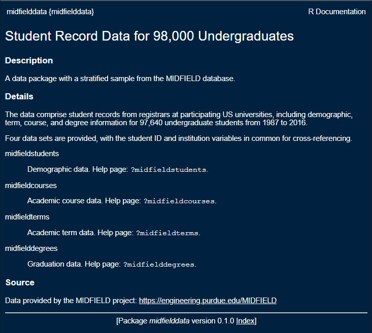

# Getting started with R {#getting-started}

<!-- This file is included in the book only if it is listed in the _bookdown.yml file. -->

If you already have R and RStudio installed, please update to the most recent releases and update your R packages as well.

If you are joining us for the first time, it is vital that you attempt to set up your computer with the necessary software in advance or it will be difficult to keep up. 

Unless noted otherwise, we assume the reader is an R novice. Thus the first steps are to install R and RStudio. 


## Install R and RStudio {#install-R-and-RStudio}

```{r echo = FALSE}
opts_chunk$set(echo = TRUE)
htmltools::img(src = knitr::include_graphics("figures/logo-R.png"), 
        alt    = "logo", 
        style  = "left:0px; padding:5px;", 
        height = "110px")
htmltools::img(src = knitr::include_graphics("figures/logo-RStudio.png"), 
        alt    = "logo", 
        style  = "left:0px; padding:5px;", 
        height = "110px")
```


Windows users may have to login as an Administrator (localmgr) before installing the software. 

- [Install R](https://cloud.r-project.org){target="_blank"} for your operating system  
- [Install RStudio](https://www.rstudio.com/products/rstudio/#Desktop){target="_blank"}, a user interface for R  

 

If you need additional assistance for Mac OS or Linux, these links might be useful 

- [Install R and RStudio on Mac OS](https://medium.com/@GalarnykMichael/install-r-and-rstudio-on-mac-e911606ce4f4{target="_blank"}) by Michael Galarnyk (or you can Google more recent instructions)    
- [How to Install R Ubuntu 16.04 Xenial](https://www.datascienceriot.com//r/install-ubuntu16/){target="_blank"} by Kris Eberwein (or you can Google more recent instructions)  

Once the installation is complete, you can take a 2-minute tour of the RStudio interface. Please use headphones or ear-buds if you watch the video during the workshop. 

- [Let's start (00:57--02:32)](https://www.youtube.com/embed/kfcX5DEMAp4?start=57&end=152){target="_blank"} by R Ladies Sydney [@RLadiesSydney:2018:Lesson1]   

The same video includes a longer (7 minute) tour of the four quadrants (panes) in RStudio if you are interested. 

- [The RStudio quadrants (07:21--14:40)](https://www.youtube.com/embed/kfcX5DEMAp4?start=441&end=880){target="_blank"} by R Ladies Sydney [@RLadiesSydney:2018:Lesson1] 


<br>    
[&#9650; top of page](#getting-started) 


## Install an R package {#install-an-r-package}

The fundamental unit of shareable code in R is the *package.* For the R novice, an R package is like an "app" for R---a collection of functions, data, and documentation for doing work in R that is easily shared with others  [@wickham2014advanced]. 

Most packages are obtained from the [CRAN](https://cran.r-project.org/){target="_blank"} website [@cranweb]. To install a package using RStudio:

- Launch RStudio 

The RStudio interface has several panes. We want the Files/Plots/Packages pane. 

- Select the *Packages*  tab  

```{r echo = FALSE}
htmltools::img(src = knitr::include_graphics("figures/rstudio-packages.png"), 
        alt   = "rstudio packages pane", 
        style = "left:0px; padding:20px;", 
        width = "700px")
```

<br>
Next, 

- Click *Install* on the ribbon 
- In the dialog box, type **tidyverse**   
- Check the *Install dependencies* box 
- Click the  *Install* button 
- Repeat to install the package **devtools** 


Alternatively (for future reference), if you prefer using the command-line, you can install a CRAN package (or a vector of packages) by typing  `install.packages()` in the Console, for example, 

```r
install.packages(pkgs = c("tidyverse", "devtools"))
```

Some packages are archived in a repository other than CRAN, GitHub being a current favorite. For such packages, we use `install_github()` from the devtools package in this form, 


```r
devtools::install_github(repo = "user_name/repo_name") 
```


<br>    
[&#9650; top of page](#getting-started) 


## Install midfielddata and midfieldr {#install-midfieldr}

```{r echo = FALSE}
opts_chunk$set(echo = TRUE)
htmltools::img(src = , 
        alt    = "logo", 
        style  = "left:0px; padding:5px;", 
        height = "110px")
htmltools::img(src = knitr::include_graphics("figures/logo-midfielddata.png"), 
        alt    = "logo", 
        style  = "left:0px; padding:5px;", 
        height = "110px")
```


In this workshop, we work with the **midfieldr** package and  **midfielddata** data-package. The **midfielddata** package is too large to be stored in CRAN, so we use a special "drat-repository" to make the package source files available. We install these packages by typing lines of code in the Console at the prompt. 


The Console in the default RStudio pane layout is on the left.  The R command prompt in the Console is `>`. 

```{r echo = FALSE}
htmltools::img(src = knitr::include_graphics("figures/rstudio-console.png"), 
        alt   = "rstudio console pane", 
        style = "left:0px; padding:20px;", 
        width = "700px")
```

<br>
At the prompt, type a line of code and press *Enter* from your keyboard. Alternatively, you can copy a line of code from this page, paste it in the console, and press *Enter*. We only run these lines of code once, so you do not have to type the lines into a script. 


<br>    
[&#9650; top of page](#getting-started) 


### Install midfielddata 

Install midfielddata from the our drat repo. The data package is large so this step takes time. Be patient and wait for the Console prompt `>` to reappear.  

```r
install.packages(pkgs = "midfielddata", 
        repos = "https://MIDFIELDR.github.io/drat/", 
        type  = "source")
```

In the Console, load the package by typing, 

```r
library("midfielddata")
```

If successful, the Console prompt `>` reappears. You should be able to view the midfielddata help page at this point by typing in the Console 

```r
? midfielddata
```

which should show the help page in the RStudio Viewer pane, 


```{r echo = FALSE}
htmltools::img(src = , 
        alt   = "midfielddata help page", 
        style = "left:0px; padding:20px;", 
        width = "700px")
```


<br>    
[&#9650; top of page](#getting-started) 


### Install midfieldr 

midfieldr can only be installed if the midfielddata installation was successful. 

```r
devtools::install_github(repo = "MIDFIELDR/midfieldr") 
```

If you receive a message like this one, see the [trouble-shooting](#troubleshoot-midfieldr) notes below.  Otherwise, continue. 

```{r echo = FALSE}
htmltools::img(src = , 
        alt   = "update package screen shot", 
        style = "left:0px; padding:20px;", 
        width = "600px")
```

If the midfieldr installation is successful, the Console prompt `>` reappears. In the Console, load the package by typing, 

```r
library("midfieldr")
```

You should be able to view the midfieldr help page at this point by typing in the Console 

```r
? midfieldr
```

which should show the help page in the RStudio Viewer pane, 


```{r echo = FALSE}
htmltools::img(src = , 
        alt   = "midfieldr help page", 
        style = "left:0px; padding:20px;", 
        width = "700px")
```


<br>    
[&#9650; top of page](#getting-started) 


### Troubleshooting {#troubleshoot-midfieldr} 

If you receive a message like the one below, then midfieldr is not installed yet. 

```{r echo = FALSE}
htmltools::img(src = , 
        alt   = "update package screen shot", 
        style = "left:0px; padding:20px;", 
        width = "600px")
```

To respond to a message like this one, 

- Press *Enter* to cancel 
- Manually install the packages listed in the message using the RStudio  *Packages &gt; Install* pane or using `install.packages("package_name")` in the Console 

In this case, for example, I would type in the Console, 

```r
install.packages("digest")
```

You can install multiple packages using a vector of package names, e.g., 

```r
install.packages(c("package-name", "another-package-name", "next-package-name"))
```

Next 

- Attempt to install midfieldr again: `devtools::install_github(repo = "MIDFIELDR/midfieldr")` 
- If the message reappears, manually install all packages listed. 
- Repeat 


Confirm the installation is successful by loading the package and checking the help page comes up. 

```r
library("midfieldr")
?midfieldr
```


<br>    
[&#9650; top of page](#getting-started) 


## Create an R project {#create-an-r-project}

To begin any project, we create an RStudio *Project* file and directory. You can recognize an R project file by its *.Rproj* suffix. 

We will create a project named after the workshop, for example, `midfield_institute.Rproj`, `fie_workshop.Rproj`, etc. 

If you prefer your instructions with commentary (please use headphones or ear-buds if you watch the video during the workshop), 

- [Start with a Project (02:34--04:50)](https://www.youtube.com/embed/kfcX5DEMAp4?start=154&end=290){target="_blank"} by R Ladies Sydney [@RLadiesSydney:2018:Lesson1] 


If you prefer basic written instructions, 

- RStudio, *File &gt; New Project... &gt; New Directory &gt; New Project* 
- Or, click the *New Project* button in the Console ribbon, 


```{r echo = FALSE}
htmltools::img(src = knitr::include_graphics("figures/rstudio-new-project.png"), 
        alt   = "rstudio new project button", 
        style = "left:0px; padding:20px;", 
        width = "700px")
```

<br>
In the dialog box that appears, 
  
- Type the workshop name as the directory name, for example, `midfield_institute`,  `fie_workshop`, etc.  
- Use the browse button to select a location on your computer to create the project  folder  
- Click the *Create Project* button  
 


<br>    
[&#9650; top of page](#getting-started) 


## Create directories {#create-directories}

While file organization is a matter of personal preference, we ask that you use the directory structure shown here for your work in the workshop. 

Create three folders in the project main directory, where  `your_project` is the name you gave the project, for example, `midfield-institute`, `fie-workshop`, `midfieldr-practice`, etc.

`r "\U2003"`                          `your-project\`  
`r "\U2003\U2003\U2003\U251C\U2500"`  `data\`  
`r "\U2003\U2003\U2003\U251C\U2500"`  `results\`  
`r "\U2003\U2003\U2003\U251C\U2500"`  `scripts\`  
`r "\U2003\U2003\U2003\U2514\U2500"`  `your-project.Rproj`  
`r "\U2003"`


If you prefer your instructions with commentary  (please use headphones or ear-buds if you watch the video during the workshop),  

- [Make some folders  (04:50--06:08)](https://www.youtube.com/embed/kfcX5DEMAp4?start=290&end=368){target="_blank"} by R Ladies Sydney [@RLadiesSydney:2018:Lesson1] 

If you prefer basic written instructions, 

- use your usual method of creating new folders on your machine 
- or you can use the *New Folder* button in the Files pane 

```{r echo = FALSE}
htmltools::img(src = knitr::include_graphics("figures/rstudio-new-folder.png"), 
        alt   = "rstudio new folder", 
        style = "left:0px; padding:20px;", 
        width = "700px")
```

<br>
We use the folders as follows: 

- `data` for data files 
- `figures` for finished data displays  
- `scripts` for R scripts that operate on data to produce results  


And that concludes the setup. 


<br>    
[&#9650; top of page](#getting-started) 


