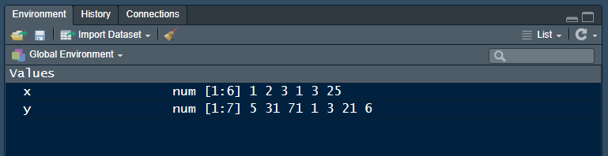

# MIDFIELD Pre-Institute Workshop {#day-0} 

<!-- This file is included only if listed in the _bookdown.yml file. -->

Agenda [[link](#day0agenda)]  

This is an **optional session** designed for R novices. If you cannot attend this session on Sunday, you are welcome to work these tutorials on your own before the Monday/Tuesday sessions. 

The tutorials give the R novice a quick introduction to three essential elements of data science using R:

- [R basics](#r-basics) 
- [Graph basics](#graph-basics) 
- [Data basics](#data-basics) 

The tutorials are designed to be completed by an R novice in less than 50 minutes each. The timing has been student-tested, but of course your mileage may vary. 

<br>
[&#9650; top of page](#day-0) 


## R basics {#r-basics} 

```{r echo = FALSE}
opts_chunk$set(echo = TRUE)
htmltools::img(src = knitr::include_graphics("figures/logo-R.png"), 
        alt    = "logo", 
        style  = "left:0px; padding:0px;", 
        height = "100px")
```

An introduction to R adapted from [@Healy:2019:Ch.2] with extra material from [@Matloff:2019]. If you already have R experience, you might still want to browse this section in case you find something new. 

If the prerequisites have been met, the tutorial should take no longer than 50 minutes.  


### Prerequisites {} 

Every tutorial assumes that   

- You completed the [Getting started](#getting-started) instructions  
- You launched `midfield_institute.Rproj` to start the R session 

One of the packages is available only on GitHub. To install it, type in the Console, 

```r
devtools::install_github("kjhealy/socviz")
```

Note on usage: The double-colon notation `package::name` accesses a function from a specific package. In this case, for example, we are accessing the `install_github()` function from the `devtools` package. 


Use *File &gt; New File &gt; R Script* to create a new R script

- Name the script `01-R-basics.R`   
- Save it in the `scripts` directory 
- Add a minimal header at the top of the script (if you wish) 
- Use `library()` to load the packages we will use 

```{r}
# workshop R basics 
# name 
# date 

library("tidyverse")
library("socviz")
```

Run the script by clicking the *Source* button. If you see an error like this one, 

    Error in library("pkg_name") : there is no package called 'pkg_name'

then you should install the missing package(s) and run the script again. 

[[To review how to install an R package]](#install-an-r-package)    


Guidelines 

- As you work through the tutorial, type a line or chunk of code then *File &gt; Save* and *Source.*   
- Confirm that your result matches the tutorial result.  
- **Your turn** exercises give you chance to devise your own examples and check them out. You learn by doing (but you knew that already)!


### Everything in R has a name {} 

In R, every object has a name. 

- named entities, like `x` or `y`  
- data you have loaded, like `my_data` 
- functions you use, like `sin()` 

Some names are forbidden 

- reserved words, like `TRUE` or `FALSE`  
- programming words, like `Inf`, `for`, `else`, and `function`  
- special entities, like `NA` and `NaN`  

Some names should not be used because they name commonly used functions 

- `q()`  quit 
- `c()` combine or concatenate 
- `mean()` 
- `range()` 
- `var()` variance 

Names in R are case-sensitive 

- `my_data` and `My_Data` are different objects 
- I follow the style guide used in the tidyverse by naming things in lower case,  with words separated by underscores, and no spaces


If you want to know if a name has already been used in a package you have loaded, go to the RStudio console, type a question mark followed by the name, e.g., 

- `? c()` 
- `? mean()`

If the name is in use, a help page appears in the RStudio Help pane.  


### Everything in R is an object  {}

Origins of R objects  

- Some objects are built in to R 
- Some objects are loaded with packages 
- Some objects are created by you 


Type this line of code in your script, Save, Source. `c()` is the function to combine or concatenate its elements to create a vector. 

```{r echo = TRUE, results = "hide"}
c(1, 2, 3, 1, 3, 25)
```

In these notes, everything that comes back to us in the Console as the result of running a script is shown prefaced by `#>`. For example, after running your script, the Console should show, 

```{r echo = FALSE}
c(1, 2, 3, 1, 3, 25)
```

But what is that `[1]` here? It's just a row label. We'll go into that later, not needed yet.

We can assign the vector to a name. 

```{r}
x <- c(1, 2, 3, 1, 3, 25)
y <- c(5, 31, 71, 1, 3, 21, 6)
```

To see the result in the Console, type the object name in the script, Save, and Source.  (Remember, type the line of code but not the line prefaced by `#>`---that's the output line so you can check your results.)

```{r}
x

y
```

You create objects my assigning them names 

- `<-` is the assignment operator (keyboard shortcut: ALT --) 
- objects exist in your R project workspace, listed in the RStudio Environment pane 


```{r echo = FALSE}
htmltools::img(src = 
, 
        alt = "rstudio new folder", 
        width = 700)
```

Datasets are also named objects, and a large number of datasets are included in the base R installation. For example,`LakeHuron` contains annual measurements of the lake level, in feet, from 1875--1972. 

```{r}
LakeHuron
```

Now you can see how the row labels work. There are 10 numbers per row, here, so the second row starts with the 11th, indicated by `[11]`. The last row starts with the 91st value `[91]` and ends with the 98th value. 

- In the Console, type `? LakeHuron` to see the help page for the data set 

Individual elements of a vector are obtained using `[]` notation. 

For example, the first five lake level readings are extracted with 

```{r}
LakeHuron[1:5]
```

The 4th element alone, 

```{r}
LakeHuron[4]
```


### Do things in R using functions  {}

Functions do something useful 

- functions are objects the perform actions for you 
- functions produce output based on the input it receives 
- functions are recognized by the parentheses at the end of their names 

The parentheses are where we include the inputs (arguments) to the function 

- `c()` concatenates the comma-separated numbers in the parentheses to create a vector 
- `mean()` computes the mean of a vector of numbers 
- `sd()` computes the standard deviation of a vector of numbers 
- `summary()` returns a summary of the object 

If we try `mean()` with no inputs, we get an error statement 


    mean()
    #> Error in mean.default() : argument "x" is missing, with no default

If we use the Lake Huron dataset as the argument, the function is computed and displayed. Add these lines to your script, Save, and Source.

```{r}
mean(LakeHuron)

sd(LakeHuron)

summary(LakeHuron)
```


We can extract subsets of data using functions. For example, If we wanted only the first five even-numbered elements, we use `c()` to create a vector of indices to the desired elements, 

```{r}
LakeHuron[c(2, 4, 6, 8, 10)]
```

If we wanted every 5th entry over the full data set, we use `length()` to determine how many entries there are, and the sequence function `seq()` to create the vector of indices, 

```{r}
n <- length(LakeHuron)
LakeHuron[seq(from = 5, to = n, by = 5)]
```


Because we will be using the ggplot2 package for graphics, we will not be using the base R `plot()` function very often, but it is useful for a quick look at data. Add these lines to your script, Save, and Source. 

```{r}
plot(LakeHuron)
```

The help pages for functions are quickly accessed via the Console. In the Console type one line at a time and *Enter* to see the function help page. 

- `? mean()` 
- `? sd()` 
- `? summary()` 


### R functions come in packages {}

Functions are bundled in packages  

- Families of useful functions are bundled into packages that you can install, load, and use 
- Packages allow you to build on the work of others 
- You can write your own functions and packages too 
- A lot of the work in data science consists of choosing the right functions and giving them the right arguments to get our data into the form we need for analysis or visualization 

Functions operate on the input you provide and give you back a result. Type the following in your script, Save, and Source.

```{r}
table(x) # table of counts

sd(y)    # standard deviation

x * 5    # multiply every element by a scalar

y + 1    # add a scalar to every element

x + x    # add elements 
```

*Comments* are annotations to make the source code easier for humans to understand but are ignored by R. Comments in R are denoted by a hashtag `#`. 


### R objects have class {}

Everything is an object and every object has a class. 

```{r}
class(x)

class(summary)
```

Certain actions will change the class of an object. Suppose we try create a vector from the `x` object and a text string, 

```{r}
new_vector <- c(x, "Apple")

new_vector

class(new_vector)
```

By adding the word "Apple" to the vector, R changed the class from "numeric" to "character". All the numbers are enclosed in quotes: they are now character strings and cannot be used in calculations. 

The most common class of data object we will use is the data frame. 

```{r}
titanic # data in the socviz package

class(titanic)
```

You can see there are four variables: `r names(titanic)`.  Two variables (columns) are numeric, two are categorical. 

You can pick variable out of a data frame using the `$` operator, 

```{r}
titanic$percent
```

From the tidyverse, we will regularly use a augmented data frame called a *tibble.* We can convert the titanic data frame to a tibble using  `as_tibble()`. 

```{r}
titanic_tb <- as_tibble(titanic)

class(titanic_tb)

titanic_tb
```

The tibble includes additional information about the variables


### R objects have structure {}


To see inside an object ask for its structure using the `str()` function. 

```{r}
str(x)

str(titanic)

str(titanic_tb)
```

I also like to use the `glimpse()` function from the tidyverse. 

```{r}
glimpse(x)

glimpse(titanic)

glimpse(titanic_tb) 
```


### R does what you tell it {}

Expect to make errors and don't worry when that happens.  You won't break anything. Healy [-@Healy:2019] offers this advice for three specific things to watch out for: 

- Make sure parentheses are balanced---that every opening `(` has a corresponding closing `)`.  
- Make sure you complete your expressions. If you see a `+` in the Console instead of the usual prompt `>`, that means that R thinks you haven't written a complete expression. You can hit `Esc` or `Ctrl C` to force your way back to the Console and try correcting the code.  
- In ggplot specifically, as you will see, we create plots layer by layer, using a `+` character at the end of the line---not at the beginning of the next line. 

For example, you would write this, 

```r
ggplot(data = mpg, aes(x = displ, y = hwy)) +
    geom_point()
```

not this,  

```r  
# error caused by incorrectly placed +
ggplot(data = mpg, aes(x = displ, y = hwy))  
    + geom_point()
```

To conclude, let's make bar graph of the `titanic` data, 

```{r fig.asp = 1/3}
ggplot(data = titanic_tb, mapping = aes(x = sex, y = n, fill = fate)) +
        geom_col() +
        coord_flip()
```


> **Your turn.** As shown, color distinguishes those who survived from those who did not and bar length gives totals by sex. Make a small change so that color denotes sex and bar length gives totals of survived and perished. 


### Pipe operator 

`%>%` is the pipe operator from the magrittr package, part of the tidyverse suite of packages. 

The pipe takes the output of one statement and makes it the input of the next statement. You can think of it as the word “then”. In this example, we'll use the `starwars` dataset from the dplyr package, 

```{r}
glimpse(starwars)
```

The following code chunk

```r
starwars %>%
        count(homeworld) 
```

could be read as, 

- start with the `starwars` object, then  
- count the number of observations `n` by homeworld 

Because each observation in `starwars` is a person, `count()` yields the number of people from a given homeworld. The result is: 

```{r echo = FALSE}
starwars %>%
        count(homeworld) 
```

The pipe makes a sequence of operations easy to construct and easy to read, 

```r
starwars %>%
        count(homeworld) %>% 
        arrange(desc(n)) %>% 
        filter(n >= 3) %>% 
        drop_na()
```

which can be read as, 

- start with the `starwars` object, then 
- count the number of observations `n` by homeworld, then 
- arrange the rows in descending order of `n`, then  
- filter to keep all rows where $n \ge 3$, then  
- drop rows with NA  

The output is 

```{r echo = FALSE}
starwars %>%
        count(homeworld) %>% 
        arrange(desc(n)) %>% 
        filter(n >= 3) %>% 
        drop_na()
```


### Keyboard shortcuts {}

In Windows, 

- `Ctrl L` clears the Console  
- `Alt -` creates the assignment operator `<-`  
- `Ctrl Enter` runs the selected line(s) of code in an R script 


Feel free to take a break before starting the next tutorial.    

<br>    
[&#9650; top of page](#day-0)    


## Graph basics {#graph-basics} 

```{r echo = FALSE}
opts_chunk$set(echo = TRUE)
htmltools::img(src = knitr::include_graphics("figures/cm201-01.png"), 
        alt   = "logo", 
        style = "left:0px; padding:0px;", 
        width = 400)
```
<small>
<br>
<i>Decline</i> by Randall Munroe (xkcd.com) is licensed under <a href="https://creativecommons.org/licenses/by-nc/2.5/">CC BY-NC 2.5</a>
<br>
</small>

An introduction to ggplot2  adapted from Chapter 3  from [@Healy:2019]. If you already have R experience, you might still want to browse this section in case you find something new. 

If the prerequisites have been met, the tutorial should take no longer than 50 minutes.  


### Prerequisites {} 

Every tutorial assumes that   

- You completed the [Getting started](#getting-started) instructions  
- You launched `midfield_institute.Rproj` to start the R session 

Use *File &gt; New File &gt; R Script* to create a new R script

- Name the script `02-graph-basics.R`   
- Save it in the `scripts` directory 
- Add a minimal header at the top of the script (if you wish) 
- Use `library()` to load the packages we will use 

```{r}
# workshop graph basics 
# name 
# date 

library("tidyverse")
library("gapminder")
```

Run the script by clicking the *Source* button. If you see an error like this one, 

    Error in library("pkg_name") : there is no package called 'pkg_name'

then you should install the missing package(s) and run the script again. 

[[To review how to install an R package]](#install-an-r-package)    


Guidelines 

- As you work through the tutorial, type a line or chunk of code then *File &gt; Save* and *Source.*   
- Confirm that your result matches the tutorial result.  
- **Your turn** exercises give you chance to devise your own examples and check them out. You learn by doing (but you knew that already)!


### Tidy data {}

If the data set is "tidy", then every row is an observation and every column is a variable.  The `gapminder` data frame is tidy. We use `glimpse()` to get a look at the structure. 

```{r}
glimpse(gapminder)
```

And we can just type its name to see the first few rows, 

```{r}
gapminder
```


Read more about [tidy data](https://r4ds.had.co.nz/tidy-data.html#tidy-data-1) in [@Wickham+Grolemund:2017].  

<br>   

> **Your turn.** The ggplot2 package includes a dataset called `mpg`. 
>
- Use `glimpse()` to examine the data set. 
- How many variables? How many observations? 
- How many of the variables are numeric? How many are character type? 
- Is the data set tidy? 
> 
> *Check your work.* There are `r nrow(mpg)` observations and `r ncol(mpg)` variables. 

```{r include = FALSE}
glimpse(mpg)
n_var      <- ncol(mpg)
n_obs      <- nrow(mpg)
n_char_var <- ncol(select_if(mpg, is.character))
n_num_var  <- ncol(select_if(mpg, is.numeric))
```


### Anatomy of a graph  

`ggplot()` is a our basic plotting function. The `data = ...` argument assigns the data frame. 

```{r}
p <- ggplot(data = gapminder)
```

Next we use the mapping argument `mapping = aes(...)` to assign variables  (column names) from the data frame to specific aesthetic properties of the graph such as the x-coordinate, the y-coordinate color, fill, etc. 

Here we will map the GDP per capita variable to `x` and the life expectancy variable to `y`. 

```{r}
p <- ggplot(data = gapminder, mapping = aes(x = gdpPercap, y = lifeExp))
```

If we try to print the graph by typing the name of the graph object (everything in R is an object), we get an empty graph because we haven't told ggplot what sort of a graph we want. 

```{r}
p
```

Because the graph will be a scatterplot, we add the `geom_point()` layer. 

```{r}
p <- p +geom_point()

p # display the graph
```

In ggplot2, "geoms" are geometric objects such as points, lines, bars, boxplots, contours, polygons, etc. You can browse the full list on the ggplot2 [geom reference page](https://ggplot2.tidyverse.org/reference/index.html#section-layer-geoms). 

We could also have simply added the layer to the original object, 

```{r}
p <- ggplot(data = gapminder, mapping = aes(x = gdpPercap, y = lifeExp)) +
        geom_point()

p # display the graph
```

Notice that the default axis labels are the variables names from the data frame. We can edit those with another layer 

```{r}
p <- p + labs(x = "GDP per capita", y = "Life expectancy (years)")

p # display the graph
```

Or, with all layers shown in one code chunk, 

```{r}
p <- ggplot(data = gapminder, mapping = aes(x = gdpPercap, y = lifeExp)) +
        geom_point() +
        labs(x = "GDP per capita", y = "Life expectancy (years)")

p # display the graph
```

Summary. The basics steps for building up the layers of any graph consist of, 

- assign the data frame 
- map variables (columns names) to aesthetic properties  
- choose geoms  
- adjust scales, labels, etc. 

For more information  

- [aes()](https://ggplot2.tidyverse.org/reference/aes.html) help page 
- [geom_point()](https://ggplot2.tidyverse.org/reference/geom_point.html) help page 
- [geom_labs()](https://ggplot2.tidyverse.org/reference/labs.html) help page 

<br>   

> **Your turn.** 
> 
- In the console, type `? mpg` to see the data set help page. Skim the descriptions of the variables.  
- Create a scatterplot of highway miles per gallon as a function of engine displacement in liters. 
> 
> *Check your work:*

```{r echo = FALSE}
ggplot(mpg, aes(displ, hwy)) +
    geom_point()
```


### Layer: smooth fit

Suppose you wanted a smooth fit curve, not necessarily linear. Add a  `geom_smooth()` layer. The name *loess* (pronounced like the proper name Lois) is a nonparametric curve-fitting method based on *local regression*. 

```{r}
p <- p + geom_smooth(method = "loess", se = FALSE)

p # display the graph
```

The `se` argument controls whether or not the confidence interval is displayed. Setting `se = TRUE` yields, 

```{r}
p <- p + geom_smooth(method = "loess", se = TRUE)

p # display the graph
```

For a linear-fit layer, we add a layer with `method` set to `lm` (short for linear model). The linear fit is not particularly good in this case, but now you know how to do one. 

```{r}
p <- p + geom_smooth(method = "lm", se = TRUE)

p # display the graph
```

For more information  

- [geom_smooth()](https://ggplot2.tidyverse.org/reference/geom_smooth.html) help page 

<br>   

> **Your turn.** Continue to practice with `mpg`.
>
- Add a loess curve fit with a confidence interval. 
> 
> *Check your work:*

```{r echo = FALSE}
ggplot(mpg, aes(displ, hwy)) +
    geom_point() +
    geom_smooth(method = "loess", se = TRUE)
```


### Layer: log scale

```{r echo = FALSE}
options(scipen = 999)
```

We have orders of magnitude differences in the GDP per capita variable. To confirm, we can create a `summary()` of the `gdpPercap`  variable. The output shows that the minimum is `r round(min(gapminder[["gdpPercap"]]), 0)`, the median  `r round(median(gapminder[["gdpPercap"]]), 0)`, and the maximum  `r round(max(gapminder[["gdpPercap"]]), 0)`. 

```{r}
# extract one variable from the data frame 
this_variable <- gapminder["gdpPercap"]

# statistical summary of one variable 
summary(this_variable)
```

The bracket notation I just used, `gapminder["gdpPercap"]`, is one way to extract a variable from a data frame. 

In exploring a graph like this, it might be useful to add a layer that changes the horizontal scale to a log-base-10 scale. 

```{r}
p <- ggplot(data = gapminder, mapping = aes(x = gdpPercap, y = lifeExp)) +
        geom_point() +
        scale_x_log10() 

p # display the graph
```

The scales package allows us to change the GDP scale to dollars. Using the syntax `thepackage::thefunction` we can use the `scales::dollar` function without loading the scales package. 

```{r}
p <- ggplot(data = gapminder, mapping = aes(x = gdpPercap, y = lifeExp)) +
        geom_point() +
        scale_x_log10(labels = scales::dollar)

p # display the graph
```

In this case, a linear fit might work, 

```{r}
p <- p + geom_smooth(method = "lm", se = TRUE)

p # display the graph
```

Update the axis labels, 

```{r}
p <- p + labs(x = "GDP per capita (log10 scale)", y = "Life expectancy (years)")

p # display the graph
```

In summary, all the layers could have been be coded at once, for example, 

```{r eval = FALSE}
p <- ggplot(data = gapminder, mapping = aes(x = gdpPercap, y = lifeExp)) +
        geom_point() +
        geom_smooth(method = "lm", se = TRUE) +
        scale_x_log10(labels = scales::dollar) +
        labs(x = "GDP per capita (log10 scale)", y = "Life expectancy (years)")
```

With all the layers in one place, we can see that we've coded all the basic steps, that is, 

- assign the data frame 
- map variables (columns names) to aesthetic properties  
- choose geoms 
- adjust scales, labels, etc. 

For more information  

- [scale_x_log10()](https://ggplot2.tidyverse.org/reference/scale_continuous.html) help page 


<br>   

> **Your turn.** Continue to practice with `mpg`.
>
- Edit the axis labels to include units.  
> 
> *Check your work:*

```{r echo = FALSE}
ggplot(mpg, aes(displ, hwy)) +
    geom_point() +
    geom_smooth(method = "loess", se = TRUE) +
    labs(x = "Engine displacement (liters)", y = "Highway fuel consumption (mpg)")
```


### Mapping aesthetics

So far, we have mapped variables only to the x-coordinate and y-coordinate aesthetics. 

If we map a variable to the color aesthetic, the data symbols are automatically assigned different colors and a legend is created. In this example, we map the `continent`  variable to color.  

```{r}
p <- ggplot(data = gapminder, 
                mapping = aes(x = gdpPercap, y = lifeExp, color = continent)) +
        geom_point() +
        scale_x_log10(labels = scales::dollar) + 
        labs(x = "GDP per capita", y = "Life expectancy (years)")

p # print the graph
```


<br>   

> **Your turn.** Continue to practice with `mpg`.
>
- Map vehicle class to color 
- Change the curve fit to linear 
> 
> *Check your work:*

```{r echo = FALSE}
ggplot(mpg, aes(displ, hwy, color = class)) +
    geom_point() +
    geom_smooth(method = "lm", se = FALSE) +
    labs(x = "Engine displacement (liters)", y = "Highway fuel consumption (mpg)")
```


### Setting properties 

Because the colors overprint, we might try making the data symbols slightly transparent. In this case, we are not mapping a property to a variable; instead, we want all data symbols to be less opaque. 

 The `alpha` argument, with $0 \leq \alpha \leq 1$, sets the transparency level. Because this change applies to all data points equally, we assign it in the geom, not `aes()`. 

```{r}
p <- ggplot(data = gapminder, 
                mapping = aes(x = gdpPercap, y = lifeExp, color = continent)) +
        geom_point(alpha = 0.3) +
        scale_x_log10(labels = scales::dollar) + 
        labs(x = "GDP per capita", y = "Life expectancy (years)")

p # print the graph
```

If we add a linear fit to these data, a fit for each continent is generated. For a thinner line, I've added a `size` argument to the geom.  

```{r}
p <- p + geom_smooth(method = "lm", se = FALSE, size = 0.5)

p # print the graph
```

If we want all the data markers the same color but we want to change the color, we don't map it, we set it in the geom. 

Here, I've omitted the aesthetic mapping to color and used a color assignment in the geom. 

```{r}
p <- ggplot(data = gapminder, mapping = aes(x = gdpPercap, y = lifeExp)) +
        geom_point(alpha = 0.3, color = "purple1") +
        geom_smooth(method = "lm", se = FALSE, size = 0.5, color = "purple4") + 
        scale_x_log10(labels = scales::dollar) + 
        labs(x = "GDP per capita (log10 scale)", y = "Life expectancy (years)")

p # print the graph
```

For more information 

- [R color names](http://www.stat.columbia.edu/~tzheng/files/Rcolor.pdf) 


### Layer: facets  

In the earlier graph where we mapped continent to color, there was a lot of overprinting, making it difficult to compare the continents. 

The `facet_wrap()` layer separates the data into different panels (or facets). Like the `aes()` mapping, `facet_wrap()` is applied to a variable (column name) in the data frame. 

```{r}
p <- p + facet_wrap(facets = vars(continent))

p # print the graph
```

Comparisons are facilitated by having the facets appear in one column, by using the `ncols` argument of `facet_wrap()`. 

```{r fig.asp = 2/1}
p <- p + facet_wrap(facets = vars(continent), ncol = 1)

p # print the graph
```

In a faceted display, all panels have identical scales (the default) to facilitate comparison. 

Again, all the layers could have been be coded at once, for example, 

```{r eval = FALSE}
ggplot(data = gapminder, mapping = aes(x = gdpPercap, y = lifeExp)) +
        geom_point(alpha = 0.3, color = "purple1") +
        geom_smooth(method = "lm", se = FALSE, size = 0.5, color = "purple4") + 
        facet_wrap(facets = vars(continent), ncol = 1) +
        scale_x_log10(labels = scales::dollar) + 
        labs(x = "GDP per capita (log10 scale)", y = "Life expectancy (years)") 
```

For more information  

- [facet_wrap()](https://ggplot2.tidyverse.org/reference/facet_wrap.html) help page 


<br>   

> **Your turn.** Continue to practice with `mpg`. 
>
- Map drive type to color 
- Facet on vehicle class 
- Add some transparency to the data symbols 
- Omit the smooth fit 
> 
> *Check your work:*

```{r echo = FALSE, fig.asp = 1, out.width = "80%"}
ggplot(mpg, aes(displ, hwy, color = drv)) +
        geom_point(alpha = 0.5) +
        facet_wrap(vars(class), as.table = FALSE) +
        labs(x = "Engine displacement (liters)", y = "Highway fuel consumption (mpg)")
```


### Ordering the panels

The default ordering of the panels in this example is alphabetical. In most cases, ordering the panels by the data (often the mean or the median) improves the display. 

Here we have two quantitative variables, but the one that is the more interesting is life expectancy. Our goal then is to order the `continent` variable by the median of the `lifeExp` variable in each panel.  

To do that, we require continent to be a *factor*, a type of variable specialized for creating ordered levels of a category. Using `glimpse()` we see that continent is already a factor (`<fct>`). 

```{r}
glimpse(gapminder)
```

Therefore all we have to do is tell R that we want the levels of continent ordered by the median of life expectancy using the `fct_reorder()` function.  

```{r}
gapminder <- gapminder %>%
        mutate(continent = fct_reorder(continent, lifeExp, median))
```

In doing so, I've overwritten the original gapminder dataset with my revised version. 


We set the `as.table ` argument to false to place the panel with the highest life expectancy in the top position. 

```{r fig.asp = 2/1}
ggplot(data = gapminder, mapping = aes(x = gdpPercap, y = lifeExp)) +
        geom_point(alpha = 0.3, color = "purple1") +
        geom_smooth(method = "lm", se = FALSE, size = 0.5, color = "purple4") + 
        facet_wrap(facets = vars(continent), ncol = 1, as.table = FALSE) + 
        scale_x_log10(labels = scales::dollar) + 
        labs(x = "GDP per capita (log10 scale)", y = "Life expectancy (years)") 
```

For more information  

- [mutate()](https://dplyr.tidyverse.org/reference/mutate.html) help page 
- [fct_reorder()](https://forcats.tidyverse.org/reference/fct_reorder.html) help page 


<br>   

> **Your turn.** Continue to practice with `mpg`. 
>
- Convert `class` to a factor ordered by the mean highway mileage 
- Same graph as before, but order the panels by mean fuel consumption  
> 
> *Check your work:*

```{r echo = FALSE, fig.asp = 1, out.width = "80%"}
mpg <- mpg %>% 
    mutate(class = fct_reorder(class, hwy, mean))

p <- ggplot(mpg, aes(displ, hwy, color = drv)) +
    geom_point(alpha = 0.5) +
    facet_wrap(vars(class), as.table = FALSE) +
    labs(x = "Engine displacement (liters)", y = "Highway fuel consumption (mpg)")
p
```


### Beyond the basics

Demonstrating how the basics can be built upon to create a complex data graphic. 

To wrap up this introduction, I'll show you how we can use functions in various layers to show all the data in every panel; add a common overall loess smooth fit; and highlight the the continent data in each panel, making it easier to compare each continent to the global data. 

Because life expectancy has generally increased over time, I'm going to restrict this final graph to 2007, the most recent year in this dataset. 

Typing this code in your script is optional. Without further explanation, here's the code. 

```{r fig.asp = 2/1, results = 'hide'}
gapminder <- gapminder %>%
        filter(year == 2007)

ggplot(data = gapminder, mapping = aes(x  = gdpPercap / 1000, y = lifeExp)) +
        geom_point(data = select(gapminder, -continent),
                size  = 1.25,
                alpha = 0.5, 
                color = "#80cdc1") +
        geom_smooth(data = select(gapminder, -continent),
                method = "loess",
                se    = FALSE,
                size  = 0.7,
                color = "#80cdc1") +
        geom_point(mapping = aes(color = continent),
                size  = 1.25,
                color = "#01665e") +
        facet_wrap(vars(continent),
                ncol = 1,
                as.table = FALSE) +
        labs(x = "GDP per capita (thousands of dollars)",
                y = "Life expectancy (years)",
                title  = "Life expectancy by country, 2007",
                caption = "Source: Gapminder") +
        theme(legend.position = "none")
```

For more information  

- [select()](https://dplyr.tidyverse.org/reference/select.html) help page 
- [filter()](https://dplyr.tidyverse.org/reference/filter.html) help page 
- [theme()](https://ggplot2.tidyverse.org/reference/index.html#section-themes) help page 
- [ColorBrewer](http://colorbrewer2.org/) for color hex codes 


### Resize and write to file 

For consistent control over the size and aspect ratio of your publication-ready graph, you should always conclude your design by saving the image and sizing it at the same time. 

Here, we save the figure to the `figures` directory we set up earlier. 

```{r}
ggsave(filename = "figures/02-graph-basics-gapminder.png", 
        width  = 6.5,
        height = 10.5,
        units  = "in", 
        dpi    = 300)
```

And the final figure looks like this: 

```{r echo = FALSE}
htmltools::img(src = knitr::include_graphics("figures/02-graph-basics-gapminder.png"), 
        alt   = "figures/02-graph-basics-gapminder", 
        style = "display: block; margin-left: auto; margin-right: auto;",  
        width = "500px")
```

For more information  

- [ggsave()](https://ggplot2.tidyverse.org/reference/ggsave.html) help page 


> **Your turn.** Continue to practice with `mpg`.
>
>
- Write your ggsave() code chunk immediately following the ggplot() code chunk of the graph you want to save. 
- Use ggsave to write your graph to the `figures` directory with the name `02-graph-basics-mpg.png` 
- Try a 6 in by 6 in figure size 
> 
> *Check your work:* Navigate to your `figures` folder. The new png file should be there. Open it to confirm it is the figure you expect. 

```{r echo = FALSE}
ggsave(filename = "figures/02-graph-basics-mpg.png", 
        plot = p, 
        width  = 6,
        height = 6,
        units  = "in", 
        dpi    = 300)
```

Feel free to take a break before starting the next tutorial.    

<br>    
[&#9650; top of page](#day-0)    


## Data basics {#data-basics}  

In [Tidy Data](https://vita.had.co.nz/papers/tidy-data.pdf), Hadley Wickham says, 

> It is often said that 80% of data analysis is spent on the process of cleaning and preparing the data. Data preparation is not just a first step, but *must be repeated many times* over the course of analysis as new problems come to light or new data is collected [emphasis mine]. 

That data preparation "must be repeated many times" cannot be overemphasized. Reproducibility starts with deliberate planning for data management, file management, and file-naming schemes and using a scripted computing environment like R (or Python, SAS, etc.). 

Other researchers may never attempt to reproduce your work---but you will. Data preparation "must be repeated many times." As [Karl Broman](https://kbroman.org/) once said, 

> Your closest collaborator is you six months ago, but you don’t reply to emails. 

The goal of this 50-minute tutorial is to introduce three basic steps of data preparation: importing data, identifying its structure, and reshaping to obtain a desired form.

<br>
```{r echo = FALSE}
df6 <- wrapr::build_frame(
        "filename"            , "item" |
        "data-basics-02.png"  , "**Step 1.** Importing raw data and writing to file." |
        "data-basics-03.png"  , "**Step 2.** Identifying the data structure." |
        "data-basics-04.png"  , "**Step 3.** Transforming, reshaping, and joining."
        ) %>%
        mutate(image = str_c("")) %>%
        select(-filename) %>%
        select(image, item) %>% 
        as_tibble()

# single-row tables to act as section headers 
heading_01 <- df6[1, ]
heading_02 <- df6[2, ]
heading_03 <- df6[3, ]

kable(df6, col.names = NULL, align = 'll')
```


### Prerequisites {} 

Every tutorial assumes that   

- You completed the [Getting started](#getting-started) instructions  
- You launched `midfield_institute.Rproj` to start the R session 

Use *File &gt; New File &gt; R Script* to create a new R script

- Name the script `03-data-basics.R`   
- Save it in the `scripts` directory 
- Add a minimal header at the top of the script (if you wish) 
- Use `library()` to load the packages we will use 

```{r}
# workshop data basics 
# name 
# date 

library("tidyverse")
library("lubridate") 
library("seplyr") 
library("rio")
library("inspectdf")
```

Run the script by clicking the *Source* button. If you see an error like this one, 

    Error in library("pkg_name") : there is no package called 'pkg_name'

then you should install the missing package(s) and run the script again. 

[[To review how to install an R package]](#install-an-r-package)    


Guidelines 

- As you work through the tutorial, type a line or chunk of code then *File &gt; Save* and *Source.*   
- Confirm that your result matches the tutorial result.  
- **Your turn** exercises give you chance to devise your own examples and check them out. You learn by doing (but you knew that already)!


### Data sets in R 

Practice data sets are included with the basic R installation and with some R packages.

To list the practice data sets available in R, type in the Console,

```r
# type in the Console 
data() 
```

which yields

     #> AirPassengers  Monthly Airline Passenger Numbers
     #> BJsales        Sales Data with Leading Indicator
     #> BOD            Biochemical Oxygen Demand
     #> CO2            Carbon Dioxide Uptake in Grass Plants
     #> Formaldehyde   Determination of Formaldehyde
     etc.

We use the `data()` function to list practice datasets included in a package (if any). For example, to determine what packages are bundled with the dplyr package, type in the Console, 

```r
# type in the Console 
data(package = "dplyr") 
```

yields

     #> band_instruments   Band membership
     #> band_instruments2  Band membership
     #> band_members       Band membership
     #> nasa               NASA spatio-temporal data
     #> starwars           Starwars characters
     #> storms             Storm tracks data

Every data set in base R and in R packages has a help page that describes the data format and variable names. The data help page can be accessed using `help()`, for example, 

```r
# type in the Console 
help(starwars, package = "dplyr")
```

Alternatively, if the package is loaded, you may run the `? item-name` syntax in the Console,  

```r
# type in the Console
library("dplyr")
? starwars
```

yields

```{r echo = FALSE}
htmltools::img(src = knitr::include_graphics("figures/starwars-help-page.png"),
               alt   = 'starwars help page',
               style = 'left:0px; padding:0px;',
               width = 600)
```


<br>

> **Your turn.** These exercises assume that you have successfully followed the instructions to [install midfielddata and midfieldr](#install-midfieldr).
>
> 1. Determine the names of the datasets available in the midfieldr package. 
>
> [*Check your work*](https://midfieldr.github.io/midfieldr/reference/index.html) 
>
> 2. Determine the variables in `case_stickiness` (one of the datasets in the midfieldr package).
>
> [*Check your work*](https://midfieldr.github.io/midfieldr/reference/case_stickiness.html) 
>
> 3. Determine the names of the datasets available in the midfielddata package. 
>
> [*Check your work*](https://midfieldr.github.io/midfielddata/index.html) 
>
> 4. Determine the variables in `midfielddegrees` (one of the datasets in the midfielddata package). 
>
> [*Check your work*](https://midfieldr.github.io/midfielddata/reference/midfielddegrees.html) 
 


 


### Data structure 

When we first encounter any data set, the first step is to characterize its structure including, 

- the R data structure, e.g., vector, matrix, data frame, time series, list, etc.  
- the number of observations 
- the number of variables 
- the name and class of each variable 

To do so, we use functions like `glimpse()` and `class()` (introduced in [R basics](#r-basics)) as well as functions from the inspectdf package (introduced in the next section). 


[[To read more about R data structures]](http://adv-r.had.co.nz/Data-structures.html){target="_blank"}    
[[To read more about inspectdf]](https://github.com/alastairrushworth/inspectdf){target="_blank"}    


### Example: Create a 2018 price index 

Over any time period with inflation, a dollar buys less at the end the period than it did at the beginning of the period. Thus, in 1973 a single 20-year old  could live comfortably on \$5/hour but in 2018 (45 years later) a 20-year-old has to earn \$`r 5 * round(251/44.4, 0)`/hour to achieve the same modest standard of living. 

We usually adjust for the effects of inflation in US dollars using the Consumer Price Index (CPI) published by the US Bureau of Labor Statistics (BLS). The CPI is available by month from the BLS or from the Federal Reserve (FRED), from 1913 to the present. 

In this example, we obtain historical Consumer Price Index data from the Federal Reserve (FRED) and perform the necessary data carpentry to graph a price index with respect to 2018 dollars. 


<br> 

```{r echo = FALSE}
##### step 1 #####
kable(heading_01, col.names = NULL, align = 'll')
```

<br>


The FRED provides CPI data from 1913 to the present as a .txt file at the URL: 

&nbsp;&nbsp; [http://research.stlouisfed.org/fred2/data/CPIAUCNS.txt](http://research.stlouisfed.org/fred2/data/CPIAUCNS.txt){target="_blank"}     

If you click on the link, you can see that the first 13 lines are metadata. The data starts on line 14 with the column names. I've added line numbers to make it easier to see. 


     1   Title:               Consumer Price Index for All Urban Consumers: All Items
     2   Series ID:           CPIAUCNS
     3   Source:              U.S. Bureau of Labor Statistics
     4   Release:             Consumer Price Index
     5   Seasonal Adjustment: Not Seasonally Adjusted
     6   Frequency:           Monthly
     7   Units:               Index 1982-1984=100
     8   Date Range:          1913-01-01 to 2019-04-01
     9   Last Updated:        2019-05-10 7:42 AM CDT
    10   Notes:               Handbook of Methods - (https://www.bls.gov/opub/hom/pdf/cpihom.pdf)
    11                        Understanding the CPI: Frequently Asked Questions -
    12                        (https://www.bls.gov/cpi/questions-and-answers.htm)
    13   
    14   DATE          VALUE
    15   1913-01-01    9.800
    16   1913-02-01    9.800 
    etc. 
                     

Assign the URL (add these lines to your script and run) 

```{r}
url <- "http://research.stlouisfed.org/fred2/data/CPIAUCNS.txt"
```

Use `rio::import()` to download the data, skipping the first 13 lines 

```{r}
x <- rio::import(url, skip = 13)
```

Use `rio::export()` to convert the txt file to CSV and write to our `data` directory 

```{r}
rio::export(x, "data/cpi-raw.csv")
```

Once you have saved raw data to file (like we did above), leave that file unaltered. Never manipulate raw data manually. 

In this workshop, we are saving all data files to the `data` directory. In larger projects, one might add a `data-raw` directory to separate raw data files from prepared data files. 

We don't have to re-import the data from the Internet every time we *Source* this R script, so we can comment-out the previous three lines of code with a hashtag, i.e.,  

```r
# url <- "http://research.stlouisfed.org/fred2/data/CPIAUCNS.txt"
# x   <- rio::import(url, skip = 13)
# rio::export(x, "data/cpi-raw.csv")
```


 

<br> 

```{r echo = FALSE}
##### step 2 #####
kable(heading_02, col.names = NULL, align = 'll')
```

<br>


Use `rio::import()` to read the raw data into the R workspace.  

```{r}
cpi <- rio::import("data/cpi-raw.csv")
```

Use `class()` to determine the R data structure---in this case, `cpi` is a tibble (a type of data frame). 

```{r}
class(cpi)
```

Use `glimpse()` to examine the tibble---we discover the number of observations (`r nrow(cpi)`), the number of variables (`r ncol(cpi)`), their names (`r names(cpi)[1]`, `r names(cpi)[2]`), and their class or type (`r class(cpi$DATE)`, `r typeof(cpi$VALUE)`).  

```{r}
glimpse(cpi)
```

The first `DATE` values suggest these are monthly data, which agrees with the frequency given in the block of metadata. The `VALUE` variable is the CPI by month indexed at 1982--1984 (for which CPI = 100). 

These data are in what Hadley Wickham calls "tidy" form, that is,

- Each variable is in a column  
- Each observation is a row  
- Each value is a cell  

Such an organization is also called a "data matrix" or a "de-normalized form"  [@Mount:2019:tidy-data]. This form is typically the desired form for data visualization using the ggplot2 package, though other forms are sometimes useful. 

Functions from the inspectdf package can tell us more about the data. First, we summarize memory usage. Here, both variable use negligible memory. 

```{r}
inspect_mem(cpi)   # memory
```

Summarize the rate of missingness. Here, there are no missing values. 

```{r}
inspect_na(cpi)    # NAs
```

Summary 

- 1276 observations, one per month, 1913-01 to 2019-04 
- 1 categorical variable  `DATE` 
- 1 quantitative variable `VALUE` (the CPI) 


<br> 

```{r echo = FALSE}
x <- midfielddata::midfielddegrees
# class(x)
# tibble::glimpse(x)
# inspectdf::inspect_mem(x) 
# inspectdf::inspect_na(x) 
```

> **Your turn.** For the `midfielddegrees` dataset from the midfielddata package, determine 
> 
- the R data structure, e.g., vector, matrix, time series, data frame, tibble, etc.
- the number of observations
- the number of variables
- the name and class of each variable 
- summary of missing values 
- summary of missing values 
> 
> *Check your work:* A tibble with `r nrow(x)` observations and `r ncol(x)` variables. The variable that requires the most memory is `id` with 6.7 Mb. Three of the variables have 51% missing values. 


<br> 

```{r echo = FALSE}
##### step 3 #####
kable(heading_03, col.names = NULL, align = 'll')
```

<br> 


For the application I have in mind, I want to convert monthly CPI to annual CPI. 

I start by changing the variable names (the column names) because I prefer lowercase names and I prefer meaningful file names (`cpi` instead of `VALUE`). 

Use `dplyr::rename(new_name = old_name)` to rename the variables. 

```{r}
cpi <- cpi %>% 
        dplyr::rename(date = DATE, cpi = VALUE) %>% 
        glimpse()
```

Before I can average the monthly CPIs by year, I need to extract the 4-digit year from the `date` variable. 

Use `lubridate::year()` to extract the year from the date and `mutate()` to create the new `year` variable. 

```{r}
cpi <- cpi %>% 
        mutate(year = lubridate::year(date)) %>% 
        glimpse()
```

Use `filter()` to omit 2019 data because we do not have a full year. Note the reduction in the number of observations. 

```{r}
cpi <- cpi %>% 
        filter(year != 2019) %>% 
        glimpse()
```

Use `arrange()` and `tail()` to confirm that 2018 is the final year. 

```{r}
cpi %>% arrange(date) %>% tail()
```

Use `seplyr::group_summarize()` operation to determine the average annual CPI. 

```{r}
grouping_variables <- c("year")
cpi_1984_basis <- seplyr::group_summarize(cpi, 
                grouping_variables, 
                cpi = mean(cpi)) %>% 
        glimpse()
```

We have an excess of significant digits. Use `round()` to reduce our annual CPI values to 2 digits. 

```{r}
cpi_1984_basis <- cpi_1984_basis %>% 
        mutate(cpi = round(cpi, 2)) %>%
        glimpse()
```

These values can be displayed,   

```{r fig.asp = 1/2}
ggplot(data = cpi_1984_basis, mapping = aes(x = year, y =  cpi)) + 
        geom_line() +
        labs(title = "CPI with a 1983--1984 basis")
```

As expected, in 1983--1984 (the basis years), CPI = 100. To shift the basis year to 2018, we extract the CPI for 2018,  

```{r}
cpi_2018 <- cpi_1984_basis %>% 
        filter(year == 2018) %>% 
        select(cpi) %>% 
        unlist(use.names = FALSE)

cpi_2018
```

Then divide all CPI values by the 2018 value to create the price index with a 2018 basis. In the basis year, the index = 1. 

```{r}
cpi_2018_basis <- cpi_1984_basis %>% 
        mutate(index = cpi / cpi_2018) %>% 
        glimpse()
```

Graph the price index,  

```{r fig.asp = 1/2}
ggplot(data = cpi_2018_basis, mapping = aes(x = year, y = index)) + 
        geom_line() +
        labs(title = "Price index with a 2018 basis")
```

The price index is used to account for inflation for any US dollar amount from 1913 to 2018 and report the results in terms of constant 2018 dollars. One simply divides the nominal dollar value by the price index for that year. 

Now that the data are prepared, we write them to file. 

```{r}
rio::export(cpi_2018_basis, "data/cpi.csv")
```


### Example: Normalized housing costs 

In this example we retrieve nominal US housing costs from the OECD database. 


<br> 

```{r echo = FALSE}
##### step 1 #####
kable(heading_01, col.names = NULL, align = 'll')
```

<br>


The long URL string below retrieves US housing costs by year from the OECD database. These are nominal costs (not adjusted for inflation) and normalized to a basis year of 2015, that is, the median house price is 100 in 2015. 

We start by importing the data and writing it to file. 

```{r eval = FALSE}
url <- "https://stats.oecd.org/sdmx-json/data/DP_LIVE/USA.HOUSECOST.NOMINAL.IDX2015.A/OECD?contentType=csv&detail=code&separator=comma&csv-lang=en&startPeriod=1956&endPeriod=2018"
x <- rio::import(url, format = "csv")
rio::export(x, "data/housing-raw.csv")
```

Again, after doing this once, we can comment-out these three lines of code so we don't have to access the internet every time we *Source* this script.

```r
# url <- "https://stats.oecd.org/sdmx-json/data/DP_LIVE/USA.HOUSECOST.NOMINAL.IDX2015.A/OECD?contentType=csv&detail=code&separator=comma&csv-lang=en&startPeriod=1956&endPeriod=2018"
# x <- rio::import(url, format = "csv")
# rio::export(x, "data/housing-raw.csv")
```


<br> 

```{r echo = FALSE}
##### step 2 #####
kable(heading_02, col.names = NULL, align = 'll')
```

<br>


Read in the CSV file and examine it. Here, we have 49 observations of 8 variables in tidy form. 

```{r}
housing <- rio::import("data/housing-raw.csv") %>% 
        glimpse()
```

We asked for data starting from 1956, but the US data in this database apparently starts in 1970, hence 49 observations, one per year, from 1970 to 2019. 

We have two numerical variables for year and normalized housing value; of the remaining variables, one is logical and the rest are categorical. 

We cam summarize the categorical variables using `inspect_cat()`.  

```{r}
inspect_cat(housing)
```

Here, the count of the number of levels for every categorical variable is 1, e.g., indicator = house cost, location = US, etc, indicating that these variables have a constant value for all years.

Memory usage is small and there are no missing values. 

```{r}
inspect_mem(housing)
inspect_na(housing)
```

Summary 

- 49 observations, one per year, 1970--2019 
- 2 quantitative variables are of interest:  `TIME` and `Value` 
- the remaining categorical and logical variables are not relevant to our inquiry 


<br> 

```{r echo = FALSE}
##### step 3 #####
kable(heading_03, col.names = NULL, align = 'll')
```

<br>


We want to keep the `TIME` and `Value` columns and rename them. 

```{r}
housing_2015_basis <- housing %>% 
        select(TIME, Value) %>% 
        dplyr::rename(year = TIME, nominal = Value) %>% 
        glimpse()
```

The costs have been normalized with a 2015 basis, that is in 2015, the price is 100. I'd like to normalize these data to 2018 costs by dividing all nominal values by the one recorded for 2018, then multiply by 100, so that the \$100 price value is in the same basis year as my price index. 

First, find the 2018 nominal house cost. 

```{r}
nominal_2018 <- housing_2015_basis %>% 
        filter(year == 2018) %>% 
        select(nominal) %>% 
        unlist(use.names = FALSE)

nominal_2018
```

Then adjust the costs so that the basis year is 2018. 

```{r}
housing_2018_basis <- housing_2015_basis %>% 
        mutate(nominal = nominal / nominal_2018 * 100)
```

Check the tail of the data frame to confirm that the 2018 value is 100. 

```{r}
tail(housing_2018_basis, n = 10L)
```

We can graph this for a look at relative nominal housing costs in the US. 

```{r}
ggplot(data = housing_2018_basis, mapping = aes(x = year, y = nominal)) +
        geom_line() +
        labs(title = "Normalized US median housing cost", 
                subtitle = "Not adjusted for inflation")
```

Now that the data are prepared, we write them to file. 

```{r}
rio::export(housing_2018_basis, "data/housing.csv")
```


### Example: Real US housing costs 

In this final example, we join the two data frames we created previously and adjust the US housing costs for inflation. The raw data have already been prepared, so we can continue step 3.


<br> 

```{r echo = FALSE}
##### step 3 #####
kable(heading_03, col.names = NULL, align = 'll')
```

<br> 


Read in the two data frames we saved earlier. Recall that both have been transformed to use a 2018 basis. 

```{r}
cpi     <- rio::import("data/cpi.csv")
housing <- rio::import("data/housing.csv")
```


The CPI data spans 1913 to 2018, with the index = 1 in 2018. 

```{r}
head(cpi)

tail(cpi)
```

The housing data spans 1970 to 2018, with nominal cost = 100 in 2018. 

```{r}
head(housing)

tail(housing)
```

Use `left_join()` to combine the two data frames, joining `cpi` to `housing`

```{r}
housing_cpi <- left_join(housing, cpi, by = "year")

head(housing_cpi)

tail(housing_cpi)
```

Usage: `left_join(x, y, by)` returns all rows from x and all columns from x and y. 'by' is a character vector of variables (column names) that x and y have in common used to join the two data frames.  

In this case, we left-join cpi (y) to housing (x) because housing has fewer years. Had we reversed the order of the two data frames, rows in x with no match in y will have NA values in the new columns, i.e., 

```{r}
test <- left_join(cpi, housing, by = "year")

head(test)

tail(test)
```

The real housing cost is determined by dividing the nominal cost by the price index, 

```{r}
housing_cpi <- housing_cpi %>% 
        mutate(real = nominal / index)

head(housing_cpi)

tail(housing_cpi)
```

Graphing normalized median US housing costs in real (constant 2018) dollars, we have, 

```{r}
ggplot(data = housing_cpi, mapping = aes(x = year, y = real)) +
        geom_line() + 
        labs(title = "Normalized US median housing cost", 
                subtitle = "Constant 2018 dollars")
```

From the graph, a monthly housing cost of \$100 in 2018 is equivalent to  approximately \$70 in 1995 and \$60 in 1970, for the *same level of housing* in *constant 2018 dollars*.  Inflation has been accounted for, so the rises and falls we see in the graph represents changes in the real cost of housing. 

The ratios hold for any amount, so a monthly housing cost of \$1000 in 2018 is equivalent to approximately \$700 in 1995 and \$600 in 1970---again, in constant 2018 dollars. 

In summary, we have used the OECD housing index to account for the fluctuations in house prices and we have used the CPI to account for inflation. 


### Summary of functions introduced 

Summary of the data preparation functions used in this tutorial, organized by package.  

dplyr 

- [`arrange()`](https://dplyr.tidyverse.org/reference/arrange.html){target="_blank"} order the rows of data frame   
- [`filter()`](https://dplyr.tidyverse.org/reference/filter.html){target="_blank"} choose rows of a data frame that meet a condition, and omit all others 
- [`mutate()`](https://dplyr.tidyverse.org/reference/mutate.html){target="_blank"} add new variables (columns) to a data frame   
- [`select()`](https://dplyr.tidyverse.org/reference/select.html){target="_blank"} choose variables (columns) of a data frame and omit all others 
- [`rename()`](https://dplyr.tidyverse.org/reference/select.html){target="_blank"} rename selected variables (columns) of a data frame and keep all others    
- [`left_join()`](https://dplyr.tidyverse.org/reference/join.html){target="_blank"} combine  two data frames by variables they have in common 

rio 

- [`import()`](https://cran.r-project.org/web/packages/rio/vignettes/rio.html){target="_blank"} read a data frame by URL or filename 
- [`export()`](https://cran.r-project.org/web/packages/rio/vignettes/rio.html){target="_blank"} write a data frame as a specified type of file 


inspectdf 

- [`inspect_mem()`](https://github.com/alastairrushworth/inspectdf){target="_blank"} summarize memory usage of a data frame  
- [`inspect_na()`](https://github.com/alastairrushworth/inspectdf){target="_blank"} summarize the rate of missingness of variables in a data frame    
- [`inspect_ cat()`](https://github.com/alastairrushworth/inspectdf){target="_blank"} summarize the levels within each categorical variable in a data frame 

lubridate 

- [`year()`](https://lubridate.tidyverse.org/reference/year.html){target="_blank"} return the year as a number from a date object 

seplyr 

- [`group_summarize()`](https://winvector.github.io/seplyr/reference/group_summarize.html){target="_blank"} perform summary operations on groups defined by selected variables 

base R 

- [`head()`](http://rfunction.com/archives/699){target="_blank"} returns the first part of an R object 
- [`tail()`](http://rfunction.com/archives/699){target="_blank"} returns the last part of an R object 
- [`mean()`](https://www.rdocumentation.org/packages/base/versions/3.6.0/topics/mean){target="_blank"} compute an arithmetic mean 
- [`round()`](https://www.rdocumentation.org/packages/base/versions/3.6.0/topics/Round){target="_blank"} round to a specified number of decimal places 
- [`unlist()`](https://www.rdocumentation.org/packages/base/versions/3.6.0/topics/unlist){target="_blank"} simplify a list to a vector of values  


<br>    
[&#9650; top of page](#day-0)    


 
