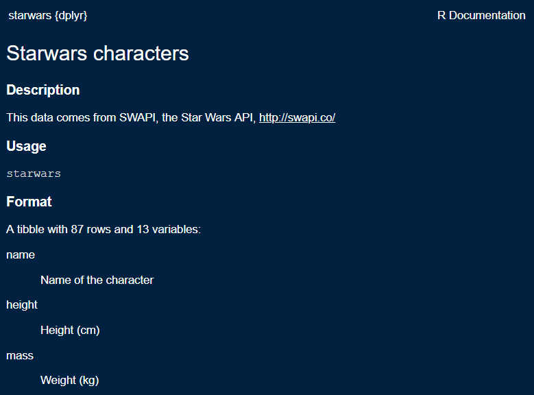

# Data basics {#data-basics}  

<!-- This file is included only if listed in the _bookdown.yml file. -->

```{r echo = FALSE}
opts_chunk$set(echo = TRUE)
htmltools::img(src = , 
        alt   = "logo", 
        style = "left:0px; padding:10px; width:100%;")
```

[Pre-Institute Workshop Agenda](#day0agenda)    

This tutorial is an introduction to data preparation using the tidyverse (and other packages) for importing data, exploring data, and tidying data. Our goal is to transform, reshape, and join data frames to obtain the form we need for analysis and graphs. 

In an exercise like this one, we perform all the work in one script, unlike a major computational project in which tasks are separated into short scripts with specific inputs and outputs. Even in this exercise, however, we  apply some  tenets of reproducibility, by 

- prescribing the file organization and file-naming scheme 
- avoiding manual operations 
- using explicit links and relative file paths 
- writing intermediate results to file 


If the prerequisites have been met, the tutorial should take about an hour. 


<br>
```{r echo = FALSE}
df6 <- wrapr::build_frame(
        "filename"            , "item" |
        "data-basics-02.png"  , "**Step 1.** Importing data" |
        "data-basics-03.png"  , "**Step 2.** Exploring data" |
        "data-basics-04.png"  , "**Step 3.** Tidying data."
        ) %>%
        mutate(image = str_c("")) %>%
        select(-filename) %>%
        select(image, item) %>% 
        as_tibble()

# single-row tables to act as section headers 
heading_01 <- df6[1, ]
heading_02 <- df6[2, ]
heading_03 <- df6[3, ]

# kable(df6, col.names = NULL, align = 'll')
```


##  Prerequisites {} 

Every tutorial assumes that   

- You completed the [Getting started](#getting-started) instructions  
- You launched `midfield_institute.Rproj` to start the R session 

Use *File &gt; New File &gt; R Script* to create a new R script

- Name the script `03-data-basics.R`   
- Save it in the `scripts` directory 
- Add a minimal header at the top of the script (if you wish) 
- Use `library()` to load the packages we will use 

```{r}
# workshop data basics 
# name 
# date 

library("tidyverse")
library("lubridate") 
library("seplyr") 
library("rio")
library("inspectdf")
library("midfieldr")
library("midfielddata")
```

Run the script by clicking the *Source* button. If you see an error like this one, 

    Error in library("pkg_name") : there is no package called 'pkg_name'

then you should install the missing package(s) and run the script again. 

[[To review how to install an R package]](#install-an-r-package)    


Guidelines 

- As you work through the tutorial, type a line or chunk of code then *File &gt; Save* and *Source.*   
- Confirm that your result matches the tutorial result.  
- **Your turn** exercises give you chance to devise your own examples and check them out. You learn by doing (but you knew that already)!


We begin by reviewing the practice datasets available in R and functions for exploring data.


<br>    
[&#9650; top of page](#data-basics) 


##  Data sets in R 

Practice data sets are included with the basic R installation and with some R packages.

To list the practice data sets available in R, type in the Console,

```r
# type in the Console 
data() 
```

which yields

     #> AirPassengers  Monthly Airline Passenger Numbers
     #> BJsales        Sales Data with Leading Indicator
     #> BOD            Biochemical Oxygen Demand
     #> CO2            Carbon Dioxide Uptake in Grass Plants
     #> Formaldehyde   Determination of Formaldehyde
     etc.

We use the `data()` function to list practice datasets included in a package (if any). For example, to determine what packages are bundled with the dplyr package, type in the Console, 

```r
# type in the Console 
data(package = "dplyr") 
```

yields

     #> band_instruments   Band membership
     #> band_instruments2  Band membership
     #> band_members       Band membership
     #> nasa               NASA spatio-temporal data
     #> starwars           Starwars characters
     #> storms             Storm tracks data

Every data set in base R and in R packages has a help page that describes the data format and variable names. The data help page can be accessed using `help()`, for example, 

```r
# type in the Console 
help(starwars, package = "dplyr")
```

Alternatively, if the package is loaded, you may run the `? item-name` syntax in the Console,  

```r
# type in the Console
library("dplyr")
? starwars
```

yields

```{r echo = FALSE}
htmltools::img(src = ,
               alt   = 'starwars help page',
               style = 'left:0px; padding:0px;',
               width = 600)
```


<br>

> **Your turn.** These exercises assume that you have successfully followed the instructions to [install midfielddata and midfieldr](#install-midfieldr).
>
> 1. Determine the names of the datasets available in the midfieldr package. 
>
> [*Check your work*](https://midfieldr.github.io/midfieldr/reference/index.html) 
>
> 2. Determine the variables in `case_stickiness` (one of the datasets in the midfieldr package).
>
> [*Check your work*](https://midfieldr.github.io/midfieldr/reference/case_stickiness.html) 
>
> 3. Determine the names of the datasets available in the midfielddata package. 
>
> [*Check your work*](https://midfieldr.github.io/midfielddata/index.html) 
>
> 4. Determine the variables in `midfielddegrees` (one of the datasets in the midfielddata package). 
>
> [*Check your work*](https://midfieldr.github.io/midfielddata/reference/midfielddegrees.html) 
 


<br>    
[&#9650; top of page](#data-basics) 
 


##  Data structure 

When we first encounter any data set, the first step is to characterize its structure including, 

- the R data structure, e.g., vector, matrix, data frame, time series, list, etc.  
- the number of observations 
- the number of variables 
- the name and class of each variable 

To do so, we use functions like `glimpse()` and `class()` (introduced in [R basics](#r-basics)) as well as functions from the inspectdf package (introduced in the next section). 


[[To read more about R data structures]](http://adv-r.had.co.nz/Data-structures.html){target="_blank"}    
[[To read more about inspectdf]](https://github.com/alastairrushworth/inspectdf){target="_blank"}    


<br>    
[&#9650; top of page](#data-basics) 


##  Example: Create a 2018 price index 

Over any time period with inflation, a dollar buys less at the end the period than it did at the beginning of the period. Thus, in 1973 a single 20-year old  could live comfortably on \$5/hour but in 2018 (45 years later) a 20-year-old has to earn \$`r 5 * round(251/44.4, 0)`/hour to achieve the same modest standard of living. 

We usually adjust for the effects of inflation in US dollars using the Consumer Price Index (CPI) published by the US Bureau of Labor Statistics (BLS). The CPI is available by month from the BLS or from the Federal Reserve (FRED), from 1913 to the present. 

In this example, we obtain historical Consumer Price Index data from the Federal Reserve (FRED) and perform the necessary data carpentry to graph a price index with respect to 2018 dollars. 


<br> 

```{r echo = FALSE}
## ## step 1 ## ##
kable(heading_01, col.names = NULL, align = 'll')
```

<br>


The FRED provides CPI data from 1913 to the present as a .txt file at the URL: 

&nbsp;&nbsp; [http://research.stlouisfed.org/fred2/data/CPIAUCNS.txt](http://research.stlouisfed.org/fred2/data/CPIAUCNS.txt){target="_blank"}     

If you click on the link, you can see that the first 13 lines are metadata. The data starts on line 14 with the column names. I've added line numbers to make it easier to see. 


     1   Title:               Consumer Price Index for All Urban Consumers: All Items
     2   Series ID:           CPIAUCNS
     3   Source:              U.S. Bureau of Labor Statistics
     4   Release:             Consumer Price Index
     5   Seasonal Adjustment: Not Seasonally Adjusted
     6   Frequency:           Monthly
     7   Units:               Index 1982-1984=100
     8   Date Range:          1913-01-01 to 2019-04-01
     9   Last Updated:        2019-05-10 7:42 AM CDT
    10   Notes:               Handbook of Methods - (https://www.bls.gov/opub/hom/pdf/cpihom.pdf)
    11                        Understanding the CPI: Frequently Asked Questions -
    12                        (https://www.bls.gov/cpi/questions-and-answers.htm)
    13   
    14   DATE          VALUE
    15   1913-01-01    9.800
    16   1913-02-01    9.800 
    etc. 
                     

Assign the URL (add these lines to your script and run) 

```{r}
url <- "http://research.stlouisfed.org/fred2/data/CPIAUCNS.txt"
```

Use `rio::import()` to download the data, skipping the first 13 lines 

```{r}
x <- rio::import(url, skip = 13)
```

Use `rio::export()` to convert the txt file to CSV and write to our `data` directory 

```{r}
rio::export(x, "data/cpi-raw.csv")
```

Once you have saved raw data to file (like we did above), leave that file unaltered. Never manipulate raw data manually. 

In this workshop, we are saving all data files to the `data` directory. In larger projects, one might add a `data-raw` directory to separate raw data files from prepared data files. 

We don't have to re-import the data from the Internet every time we *Source* this R script, so we can comment-out the previous three lines of code with a hashtag, i.e.,  

```r
# url <- "http://research.stlouisfed.org/fred2/data/CPIAUCNS.txt"
# x   <- rio::import(url, skip = 13)
# rio::export(x, "data/cpi-raw.csv")
```


 

<br> 

```{r echo = FALSE}
## ## step 2 ## ##
kable(heading_02, col.names = NULL, align = 'll')
```

<br>


Use `rio::import()` to read the raw data into the R workspace.  

```{r}
cpi <- rio::import("data/cpi-raw.csv")
```

Use `class()` to determine the R data structure---in this case, `cpi` is a data frame. 

```{r}
class(cpi)
```

Use `glimpse()` to examine the data frame---we discover the number of observations (`r nrow(cpi)`), the number of variables (`r ncol(cpi)`), their names (`r names(cpi)[1]`, `r names(cpi)[2]`), and their class or type (`r class(cpi$DATE)`, `r typeof(cpi$VALUE)`).  

```{r}
glimpse(cpi)
```

The first `DATE` values suggest these are monthly data, which agrees with the frequency given in the block of metadata. The `VALUE` variable is the CPI by month indexed at 1982--1984 (for which CPI = 100). 

These data are in what Hadley Wickham calls "tidy" form, that is,

- Each variable is in a column  
- Each observation is a row  
- Each value is a cell  

Such an organization is also called a "data matrix" or a "de-normalized form"  [@Mount:2019:tidy-data]. This form is typically the desired form for data visualization using the ggplot2 package, though other forms are sometimes useful. 

Functions from the inspectdf package can tell us more about the data. First, we summarize memory usage. Here, both variable use negligible memory. 

```{r}
inspect_mem(cpi)   # memory
```

Summarize the rate of missingness. Here, there are no missing values. 

```{r}
inspect_na(cpi)    # NAs
```

Summary 

- 1276 observations, one per month, Jan 1913 through Apr 2019  
- 1 categorical variable  `DATE` 
- 1 quantitative variable `VALUE` (the CPI) 


<br> 

```{r echo = FALSE}
x <- midfielddata::midfielddegrees
# class(x)
# tibble::glimpse(x)
# inspectdf::inspect_mem(x) 
# inspectdf::inspect_na(x) 
```

> **Your turn.** For the `midfielddegrees` dataset from the midfielddata package, determine 
> 
- the R data structure, e.g., vector, matrix, time series, data frame, tibble, etc.
- the number of observations
- the number of variables
- the name and class of each variable 
- summary of missing values 
- summary of missing values 
> 
> *Check your work:* A tibble with `r nrow(x)` observations and `r ncol(x)` variables. The variable that requires the most memory is `id` with 6.7 Mb. Three of the variables have 51% missing values. 


<br> 

```{r echo = FALSE}
## ## step 3 ## ##
kable(heading_03, col.names = NULL, align = 'll')
```

<br> 


For the application I have in mind, I want to convert monthly CPI to annual CPI. 

I start by changing the variable names (the column names) because I prefer lowercase names and I prefer meaningful file names (`cpi` instead of `VALUE`). 

Use `dplyr::rename(new_name = old_name)` to rename the variables. 

```{r}
cpi <- cpi %>% 
        dplyr::rename(date = DATE, cpi = VALUE) %>% 
        glimpse()
```

Before I can average the monthly CPIs by year, I need to extract the 4-digit year from the `date` variable. 

Use `lubridate::year()` to extract the year from the date and `mutate()` to create the new `year` variable. 

```{r}
cpi <- cpi %>% 
        mutate(year = lubridate::year(date)) %>% 
        glimpse()
```

Use `filter()` to omit 2019 data because we do not have a full year. Note the reduction in the number of observations. 

```{r}
cpi <- cpi %>% 
        filter(year != 2019) %>% 
        glimpse()
```

Use `arrange()` and `tail()` to confirm that 2018 is the final year. 

```{r}
cpi %>% arrange(date) %>% tail()
```

Use `seplyr::group_summarize()` operation to determine the average annual CPI. 

```{r}
grouping_variables <- c("year")
cpi_1984_basis <- seplyr::group_summarize(cpi, 
                grouping_variables, 
                cpi = mean(cpi)) %>% 
        glimpse()
```

We have an excess of significant digits. Use `round()` to reduce our annual CPI values to 2 digits. 

```{r}
cpi_1984_basis <- cpi_1984_basis %>% 
        mutate(cpi = round(cpi, 2)) %>%
        glimpse()
```

These values can be displayed,   

```{r fig.asp = 1/2}
ggplot(data = cpi_1984_basis, mapping = aes(x = year, y =  cpi)) + 
        geom_line() +
        labs(title = "CPI with a 1983--1984 basis")
```

As expected, in 1983--1984 (the basis years), CPI = 100. To shift the basis year to 2018, we extract the CPI for 2018,  

```{r}
cpi_2018 <- cpi_1984_basis %>% 
        filter(year == 2018) %>% 
        select(cpi) %>% 
        unlist(use.names = FALSE)

cpi_2018
```

Then divide all CPI values by the 2018 value to create the price index with a 2018 basis. In the basis year, the index = 1. 

```{r}
cpi_2018_basis <- cpi_1984_basis %>% 
        mutate(index = cpi / cpi_2018) %>% 
        glimpse()
```

Graph the price index,  

```{r fig.asp = 1/2}
ggplot(data = cpi_2018_basis, mapping = aes(x = year, y = index)) + 
        geom_line() +
        labs(title = "Price index with a 2018 basis")
```

The price index is used to account for inflation for any US dollar amount from 1913 to 2018 and report the results in terms of constant 2018 dollars. One simply divides the nominal dollar value by the price index for that year. 

Now that the data are prepared, we write them to file. 

```{r}
rio::export(cpi_2018_basis, "data/cpi.csv")
```


<br>    
[&#9650; top of page](#data-basics) 


##  Example: Normalized housing costs 

In this example we retrieve nominal US housing costs from the OECD database. 


<br> 

```{r echo = FALSE}
## ## step 1 ## ##
kable(heading_01, col.names = NULL, align = 'll')
```

<br>


The long URL string below retrieves US housing costs by year from the OECD database. These are nominal costs (not adjusted for inflation) and normalized to a basis year of 2015, that is, the median house price is 100 in 2015. 

We start by importing the data and writing it to file. 

```{r eval = FALSE}
url <- "https://stats.oecd.org/sdmx-json/data/DP_LIVE/USA.HOUSECOST.NOMINAL.IDX2015.A/OECD?contentType=csv&detail=code&separator=comma&csv-lang=en&startPeriod=1956&endPeriod=2018"
x <- rio::import(url, format = "csv")
rio::export(x, "data/housing-raw.csv")
```

Again, after doing this once, we can comment-out these three lines of code so we don't have to access the internet every time we *Source* this script.

```r
# url <- "https://stats.oecd.org/sdmx-json/data/DP_LIVE/USA.HOUSECOST.NOMINAL.IDX2015.A/OECD?contentType=csv&detail=code&separator=comma&csv-lang=en&startPeriod=1956&endPeriod=2018"
# x <- rio::import(url, format = "csv")
# rio::export(x, "data/housing-raw.csv")
```


<br> 

```{r echo = FALSE}
## ## step 2 ## ##
kable(heading_02, col.names = NULL, align = 'll')
```

<br>


Read in the CSV file and examine it. Here, we have 49 observations of 8 variables in tidy form. 

```{r}
housing <- rio::import("data/housing-raw.csv") %>% 
        glimpse()
```

We asked for data starting from 1956, but the US data in this database apparently starts in 1970, hence 49 observations, one per year, from 1970 to 2019. 

We have two numerical variables for year and normalized housing value; of the remaining variables, one is logical and the rest are categorical. 

We cam summarize the categorical variables using `inspect_cat()`.  

```{r}
inspect_cat(housing)
```

Here, the count of the number of levels for every categorical variable is 1, e.g., indicator = house cost, location = US, etc, indicating that these variables have a constant value for all years.

Memory usage is small and there are no missing values. 

```{r}
inspect_mem(housing)
inspect_na(housing)
```

Summary 

- 49 observations, one per year, 1970--2019 
- 2 quantitative variables are of interest:  `TIME` and `Value` 
- the remaining categorical and logical variables are not relevant to our inquiry 


<br> 

```{r echo = FALSE}
## ## step 3 ## ##
kable(heading_03, col.names = NULL, align = 'll')
```

<br>


We want to keep the `TIME` and `Value` columns and rename them. 

```{r}
housing_2015_basis <- housing %>% 
        select(TIME, Value) %>% 
        dplyr::rename(year = TIME, nominal = Value) %>% 
        glimpse()
```

The costs have been normalized with a 2015 basis, that is in 2015, the price is 100. I'd like to normalize these data to 2018 costs by dividing all nominal values by the one recorded for 2018, then multiply by 100, so that the \$100 price value is in the same basis year as my price index. 

First, find the 2018 nominal house cost. 

```{r}
nominal_2018 <- housing_2015_basis %>% 
        filter(year == 2018) %>% 
        select(nominal) %>% 
        unlist(use.names = FALSE)

nominal_2018
```

Then adjust the costs so that the basis year is 2018. 

```{r}
housing_2018_basis <- housing_2015_basis %>% 
        mutate(nominal = nominal / nominal_2018 * 100)
```

Check the tail of the data frame to confirm that the 2018 value is 100. 

```{r}
tail(housing_2018_basis, n = 10L)
```

We can graph this for a look at relative nominal housing costs in the US. 

```{r}
ggplot(data = housing_2018_basis, mapping = aes(x = year, y = nominal)) +
        geom_line() +
        labs(title = "Normalized US median housing cost", 
                subtitle = "Not adjusted for inflation")
```

Now that the data are prepared, we write them to file. 

```{r}
rio::export(housing_2018_basis, "data/housing.csv")
```


<br>    
[&#9650; top of page](#data-basics) 


##  Example: Real US housing costs 

In this final example, we join the two data frames we created previously and adjust the US housing costs for inflation. The raw data have already been prepared, so we can continue step 3.


<br> 

```{r echo = FALSE}
## ## step 3 ## ##
kable(heading_03, col.names = NULL, align = 'll')
```

<br> 


Read in the two data frames we saved earlier. Recall that both have been transformed to use a 2018 basis. 

```{r}
cpi     <- rio::import("data/cpi.csv")
housing <- rio::import("data/housing.csv")
```


The CPI data spans 1913 to 2018, with the index = 1 in 2018. 

```{r}
head(cpi)

tail(cpi)
```

The housing data spans 1970 to 2018, with nominal cost = 100 in 2018. 

```{r}
head(housing)

tail(housing)
```

Use `left_join()` to combine the two data frames, joining `cpi` to `housing`

```{r}
housing_cpi <- left_join(housing, cpi, by = "year")

head(housing_cpi)

tail(housing_cpi)
```

Usage: `left_join(x, y, by)` returns all rows from x and all columns from x and y. 'by' is a character vector of variables (column names) that x and y have in common used to join the two data frames.  

In this case, we left-join cpi (y) to housing (x) because housing has fewer years. Had we reversed the order of the two data frames, rows in x with no match in y will have NA values in the new columns, i.e., 

```{r}
test <- left_join(cpi, housing, by = "year")

head(test)

tail(test)
```

The real housing cost is determined by dividing the nominal cost by the price index, 

```{r}
housing_cpi <- housing_cpi %>% 
        mutate(real = nominal / index)

head(housing_cpi)

tail(housing_cpi)
```

Graphing normalized median US housing costs in real (constant 2018) dollars, we have, 

```{r}
ggplot(data = housing_cpi, mapping = aes(x = year, y = real)) +
        geom_line() + 
        labs(title = "Normalized US median housing cost", 
                subtitle = "Constant 2018 dollars")
```

From the graph, a monthly housing cost of \$100 in 2018 is equivalent to  approximately \$70 in 1995 and \$60 in 1970, for the *same level of housing* in *constant 2018 dollars*.  Inflation has been accounted for, so the rises and falls we see in the graph represents changes in the real cost of housing. 

The ratios hold for any amount, so a monthly housing cost of \$1000 in 2018 is equivalent to approximately \$700 in 1995 and \$600 in 1970---again, in constant 2018 dollars. 

In summary, we have used the OECD housing index to account for the fluctuations in house prices and we have used the CPI to account for inflation. 


<br>    
[&#9650; top of page](#data-basics) 


##  Summary of functions introduced 

Summary of the data preparation functions used in this tutorial, organized by package.  

dplyr 

- [`arrange()`](https://dplyr.tidyverse.org/reference/arrange.html){target="_blank"} order the rows of data frame   
- [`filter()`](https://dplyr.tidyverse.org/reference/filter.html){target="_blank"} choose rows of a data frame that meet a condition, and omit all others 
- [`mutate()`](https://dplyr.tidyverse.org/reference/mutate.html){target="_blank"} add new variables (columns) to a data frame   
- [`select()`](https://dplyr.tidyverse.org/reference/select.html){target="_blank"} choose variables (columns) of a data frame and omit all others 
- [`rename()`](https://dplyr.tidyverse.org/reference/select.html){target="_blank"} rename selected variables (columns) of a data frame and keep all others    
- [`left_join()`](https://dplyr.tidyverse.org/reference/join.html){target="_blank"} combine  two data frames by variables they have in common 

rio 

- [`import()`](https://cran.r-project.org/web/packages/rio/vignettes/rio.html){target="_blank"} read a data frame by URL or filename 
- [`export()`](https://cran.r-project.org/web/packages/rio/vignettes/rio.html){target="_blank"} write a data frame as a specified type of file 


inspectdf 

- [`inspect_mem()`](https://github.com/alastairrushworth/inspectdf){target="_blank"} summarize memory usage of a data frame  
- [`inspect_na()`](https://github.com/alastairrushworth/inspectdf){target="_blank"} summarize the rate of missingness of variables in a data frame    
- [`inspect_ cat()`](https://github.com/alastairrushworth/inspectdf){target="_blank"} summarize the levels within each categorical variable in a data frame 

lubridate 

- [`year()`](https://lubridate.tidyverse.org/reference/year.html){target="_blank"} return the year as a number from a date object 

seplyr 

- [`group_summarize()`](https://winvector.github.io/seplyr/reference/group_summarize.html){target="_blank"} perform summary operations on groups defined by selected variables 

base R 

- [`head()`](http://rfunction.com/archives/699){target="_blank"} returns the first part of an R object 
- [`tail()`](http://rfunction.com/archives/699){target="_blank"} returns the last part of an R object 
- [`mean()`](https://www.rdocumentation.org/packages/base/versions/3.6.0/topics/mean){target="_blank"} compute an arithmetic mean 
- [`round()`](https://www.rdocumentation.org/packages/base/versions/3.6.0/topics/Round){target="_blank"} round to a specified number of decimal places 
- [`unlist()`](https://www.rdocumentation.org/packages/base/versions/3.6.0/topics/unlist){target="_blank"} simplify a list to a vector of values  


<br>    
[&#9650; top of page](#data-basics)    


 


