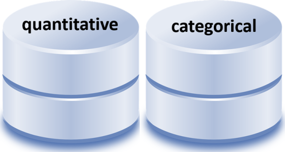
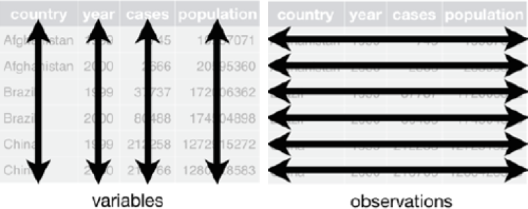

## Data basics {#data-basics}  

<!-- Use  knitr:: child = to include as a section in a chapter-->

```{r include = FALSE}
library(knitr)
opts_chunk$set(echo = FALSE)
opts_chunk$set(fig.width = 6, 
        out.width = "70%", 
        fig.align = "center", 
        fig.asp   = 0.618, 
        comment   = "#>", 
        warning   = FALSE, 
        message   = FALSE)

library("tidyverse")
```

An introduction to data carpentry. In [Tidy Data](https://vita.had.co.nz/papers/tidy-data.pdf), Hadley Wickham says, 

> It is often said that 80% of data analysis is spent on the process of cleaning and preparing the data. Data preparation is not just a first step, but must be repeated many times over the course of analysis as new problems come to light or new data is collected. 

The goal of this 50-minute tutorial is to introduce the R novice to the basic  elements of data carpentry. The essential skills can be grouped into four basic categories: 


```{r echo = FALSE}
library("magick")
image_read("figures/sd021-09.png") %>% 
        image_scale("300") %>% 
        image_write(., path = "figures/data-basics-01.png")
image_read("figures/sd021-02.png") %>% 
        image_scale("300") %>% 
        image_write(., path = "figures/data-basics-02.png")
image_read("figures/sd011-14.png") %>% 
        image_scale("x300") %>%  
        image_write(., path = "figures/data-basics-03a.png")
image_read("figures/sd011-14b.png") %>% 
        image_scale("x300")  %>%        
        image_write(., path = "figures/data-basics-03b.png") 
image_read("figures/sd021-01.png") %>% 
        image_scale("300") %>% 
        image_write(., path = "figures/data-basics-04.png")

img3a <- image_read("figures/data-basics-03a.png")
img3b <- image_read("figures/data-basics-03b.png")
image_append(c(img3a, img3b), stack = FALSE) %>% 
        image_scale("300") %>% 
        image_write(., path = "figures/data-basics-03.png")
```

```{r echo = FALSE}
df6 <- wrapr::build_frame(
        "filename"            , "item" |
        "data-basics-01.png"  , "Acquire the raw data and save it locally." |
        "data-basics-02.png"  , "Import the raw data into R and examine it." |
        "data-basics-03.png"  , "Identify the data structure, the number of observations, the number of variables, and their type." |
        "data-basics-04.png"  , "Transform and reshape the data to the desired form for your intended graph or analysis; write it to file."
        ) %>%
        mutate(image = str_c("")) %>%
        select(-filename) %>%
        select(image, item)
kable(df6, col.names = NULL, align = 'll')
```


### Data sources

**Online, open-source data.** While we won't be using external data sources like these in today's work, we thought you might appreciate having a glimpse of what is available. Here is a small sample of online, open-data sources: 

- [Center for Disease Control](https://www.cdc.gov/datastatistics/index.html)  
- [Global Health Observatory](http://apps.who.int/gho/data/node.home) World Health Organization (WHO) data repository
- [Human Mortality Database](http://www.mortality.org/) detailed mortality and population data  
- [OECD Data](https://data.oecd.org/) Organisation for Economic Co-operation and Development 
- [FiveThirtyEight](https://fivethirtyeight.com/) Datasets used in its articles available via GitHub repository
- [Guardian Datablog](https://www.theguardian.com/data) Provides a lot of free-to-use data via Google spreadsheets.
- [Gapminder](https://www.gapminder.org/data/) Data in Gapminder World (over 500 entries).
- [American Community Survey](https://www.census.gov/programs-surveys/acs/) US Census Bureau  
- [Bureau of Justice](https://www.bjs.gov/index.cfm?ty=abu) statistics and data.
- [Open.canada.ca](https://open.canada.ca/en/open-data) Canadian Government open data  
- [Data.gov](https://www.data.gov/) US Government open data  
- [Data.gov.au](https://data.gov.au/) Australian government open data  
- [Data.gov.nz](https://data.gov.nz/) New Zealand government open data    
- [Data.gov.uk](https://data.gov.uk/) UK government open data  


<br>
**Practice data sets in R.** Practice data sets are included with the basic R installation and with some R packages. 

To list the practice data sets available in R, type in the Console, 

```r 
data() # to list data sets in base R 
```

yields 

     #> AirPassengers  Monthly Airline Passenger Numbers
     #> BJsales        Sales Data with Leading Indicator
     #> BOD            Biochemical Oxygen Demand
     #> CO2            Carbon Dioxide Uptake in Grass Plants
     #> Formaldehyde   Determination of Formaldehyde
     etc.

To list the practice data sets available in an R package (if any), type in the Console, 

```r 
library("dplyr")
data(package = "dplyr") # to list data sets an R package 
```

yields

     #> band_instruments   Band membership
     #> band_instruments2  Band membership
     #> band_members       Band membership
     #> nasa               NASA spatio-temporal data
     #> starwars           Starwars characters
     #> storms             Storm tracks data

Every data set in base R and in R packages has a help page that describes format of the data and the variable names with short descriptions. Type in the Console a question mark followed by the name of the data set, e.g., 

```r
? starwars
```

yields

```{r echo = FALSE}
htmltools::img(src = knitr::include_graphics("figures/starwars-help-page.png"),
               alt   = 'starwars help page',
               style = 'left:0px; padding:0px;',
               width = 600)
```


<br>
Data in base R and in R packages are automatically loaded 

- Launching R loads all data sets in base R  
- Loading a package with `library()` loads all the data sets in the package  
- All other data files have to be read or web-scraped  explicitly 


 
### Exercises 

1. Determine the data sets included in the midfielddata package.  
1. Determine the variables in the `midfielddegrees` data set from the midfielddata package.  
1. Determine the data sets included in the midfieldr package.  
1. Determine the variables in the `case_stickiness` data set from the midfieldr package. 


### Acquire raw data 

Obtain data from its original source and save it locally. Raw data should never be operated on manually. 

```{r echo = FALSE}
htmltools::img(src = ,
               alt   = '',
               style = 'left:0px; padding:0px;', 
               width = 300)
```


### Import data into R

Bring your data into the R environment to examine it. 

```{r echo = FALSE}
htmltools::img(src = ,
               alt   = '',
               style = 'left:0px; padding:0px;', 
               width = 300)
```


### Classify the data structure 

Identify the number of observations, the number of variables, and their type. 

```{r echo = FALSE}
htmltools::img(src = ,
               alt   = '',
               style = 'left:0px; padding:0px;', 
               width = 300)
```


### Transform and reshape data 

Transform and reshape the data to obtain the shape you need for your application. 

```{r echo = FALSE}
htmltools::img(src = ,
               alt   = '',
               style = 'left:0px; padding:0px;', 
               width = 300)
```


